# Vector — Roblox Studio Copilot

A **Roblox Studio AI copilot** with a **Next.js backend** and an **LLM tool-calling orchestrator**, designed to mirror Cline's step-by-step tool usage, context management, and diff-first editing. Vector enables safe, undoable changes to Roblox places through a docked chat UI in Studio, with proposals for edits, instance operations, and asset integrations.
[](https://youtu.be/BAoDPCdBlew)

## Overview

- **Studio Plugin (Luau)**: Provides a docked chat interface, reads active editor state, previews diffs, and applies edits inside Roblox's `ChangeHistoryService`. It communicates with the backend for LLM orchestration.
- **Next.js Backend (TypeScript)**: Handles API endpoints for chat, streaming, proposals, and asset search/generation. Orchestrates LLM tool calls with a deterministic, proposal-first workflow.
- **LLM Tool-Calling**: One-tool-per-message, approval-first (like Cline). The model proposes changes; only the plugin applies them after user approval. Supports providers like OpenRouter and Gemini.
- **Key Features**:
  - Diff previews and safe edits with undo support.
  - Instance creation, property setting, renaming, and deletion.
  - Asset Store integration (search and insert from Roblox Catalog).
  - 3D generation via Meshy API.
  - Streaming status updates and multi-turn conversations.
  - Context gathering (active script, selection, open documents).
  - Audit logging and persistence for proposals and workflows.

## Architecture

Vector follows a **runtime split**: the backend (Next.js on Vercel or local) handles planning, LLM calls, and tool orchestration; the Studio plugin (Luau) reads context, previews changes, and performs writes with undo/redo. All mutations are wrapped in `ChangeHistoryService` for safety.

### High-Level Components
- **Backend (Next.js)**: API routes, orchestrator, tool schemas, providers, data stores.
- **Plugin (Luau)**: UI, network helpers, tool handlers for Roblox APIs.
- **Data Flow**: User input → Context gathering → LLM tool call → Proposal generation → Approval → Apply with undo → Audit.

### Mermaid Diagram: System Architecture and Data Flow

```mermaid
flowchart TD
    %% User and Studio Plugin
    subgraph Studio_Plugin["Roblox Studio Plugin (Luau)"]
        UI[Chat UI + Composer] --> ContextCollector["Context Collector<br/>(Active Script, Selection)"]
        ContextCollector --> ChatAPI["/api/chat POST"]
        ChatAPI --> ProposalRenderer["Proposal Renderer<br/>(Diffs/Ops Preview)"]
        ProposalRenderer --> ApprovalGate{User Approves?}
        ApprovalGate -- Yes --> ToolExecutor["Tool Executor<br/>(Apply Edit / Insert Asset)"]
        ToolExecutor --> ChangeHistory["ChangeHistoryService<br/>(Undo Step)"]
        ChangeHistory --> ApplyAPI["/api/proposals/:id/apply POST"]
        ApprovalGate -- No --> Reject[Reject Proposal]
        StreamPoller["/api/stream Long-Poll"] --> StatusUI["Status Panel<br/>(Streaming Updates)"]
    end

    %% Backend and Orchestrator
    subgraph Backend["Next.js Backend (TypeScript)"]
        ChatAPI --> Orchestrator[LLM Orchestrator]
        Orchestrator --> SystemPrompt[System Prompt + Tool Registry]
        SystemPrompt --> LLM["LLM Provider<br/>(OpenRouter / Gemini)"]
        LLM --> ToolParser[Tool Call Parser]
        ToolParser --> ProposalBuilder["Proposal Builder<br/>(Edits / Object Ops / Asset Ops)"]
        ProposalBuilder --> ChatAPI
        ProposalBuilder --> ProposalsStore[("Proposals Store<br/>(JSON / DB)")]
        ApplyAPI --> ProposalsStore
        StreamPoller --> StreamBus["Stream Bus<br/>(Events: Tool Results, Errors)"]
        StreamBus --> StatusUI
        AssetSearchAPI["/api/assets/search GET"] --> CatalogProvider["Catalog Provider<br/>(Roblox API / Stub)"]
        CatalogProvider --> Orchestrator
        Generate3DAPI["/api/assets/generate3d POST"] --> MeshyAPI["Meshy API<br/>(Text-to-3D)"]
        MeshyAPI --> OpenCloud["Roblox Open Cloud<br/>(Asset Upload)"]
        OpenCloud --> Orchestrator
    end

    %% Context and Memory
    subgraph Context_Memory["Context and Memory"]
        Orchestrator --> ContextManager["Context Manager<br/>(Token Tracking, Summarization)"]
        ContextManager --> ToolCache[("Tool Result Cache<br/>(Fingerprints + TTL)")]
        ToolCache --> Orchestrator
        ProposalsStore --> WorkflowLedger[("Workflow Ledger<br/>(Steps, Fingerprints, Audit)")]
        WorkflowLedger --> ContextManager
    end

    %% Links
    UserInput[User Input] --> UI
    ToolExecutor --> WorkflowLedger
    LLM --> StreamBus
    ContextCollector --> ContextManager

    %% Notes as side nodes (valid on GitHub)
    ApprovalGate -.-> Note1["📌 Approval required for all writes<br/>One undo step per apply"]:::note
    Orchestrator -.-> Note2["📌 One tool per LLM message<br/>Deterministic fallbacks on errors"]:::note
    StreamBus -.-> Note3["📌 Long-poll for Studio<br/>SSE for dashboards"]:::note

    %% Styles
    classDef note fill:#f5f5f7,stroke:#c7c7cc,color:#111,stroke-width:1px,font-style:italic;

```



This diagram illustrates the core data flow, runtime components, and integrations. The plugin handles UI and Roblox writes; the backend manages LLM orchestration, asset search/generation, and persistence.

## Features in Detail

### 1. Editing Workflow (Diff-First, Approval-First)
- **Preview**: LLM proposes edits via `show_diff`; plugin renders unified diffs.
- **Apply**: On approval, `apply_edit` runs with `ChangeHistoryService` for undo support.
- **Safety**: `beforeHash` validation prevents conflicts; edits are sorted, non-overlapping, and capped (≤20 edits, ≤2000 chars).
- **Multi-File**: Server-side diff3 merging with conflict detection.

### 2. Instance Operations
- `create_instance`, `set_properties`, `rename_instance`, `delete_instance`.
- Selection inference: Defaults to selected instance if not specified.
- All wrapped in `ChangeHistoryService` for single undo steps.

### 3. Asset Store Integration
- `search_assets`: Queries Roblox Catalog (real API or stubs).
- `insert_asset`: Inserts by ID and optionally configures via `set_properties`.
- 3D Generation: `generate_asset_3d` proxies to Meshy API → Open Cloud upload.

### 4. Context Gathering
- **Plugin**: Reads active script, selection, open documents.
- **Backend**: Tools like `get_active_script`, `list_selection`, `list_open_documents`.
- **Mentions**: Supports `@file`, `@folder`, `@url`, `@problems` for attachments.
- **Caching**: Tool results cached with fingerprints to avoid re-reading unchanged code.

### 5. Streaming and Multi-Turn Conversations
- **Plan/Act Modes**: Multi-turn loops with context tools executed locally.
- **Streaming**: Long-poll (`/api/stream`) for Studio; SSE (`/api/stream/sse`) for dashboards.
- **Status**: Real-time updates via event bus (e.g., tool results, errors).
- **Memory**: Workflow ledger tracks steps; auto-compaction when near token limits.

### 6. Safety and Permissions
- **Permissions**: First-time HTTP and Script Modification prompts in Studio.
- **Audit**: Proposals, applies, and outcomes logged.
- **Guardrails**: Deterministic fallbacks; no broad rewrites without approval.

## Installation and Setup

### Prerequisites
- Node.js 18+ for the backend.
- Roblox Studio for the plugin.
- Optional: Rojo for plugin syncing during dev.

### Backend (Next.js)
1. Navigate to `vector/apps/web`:
   ```bash
   cd vector/apps/web
   npm install
   ```
2. Configure `.env.local` (already added):
   - `OPENROUTER_API_KEY=` (for OpenRouter provider; leave blank for fallbacks).
   - `OPENROUTER_MODEL=moonshotai/kimi-k2:free`.
   - `VECTOR_USE_OPENROUTER=0` (set to `1` to enable).
   - `VECTOR_DEFAULT_PROVIDER=openrouter` (or `gemini`).
   - `GEMINI_API_KEY=` (for direct Gemini calls).
   - `CATALOG_API_URL=` (for real catalog search; optional).
   - `MESHY_API_KEY=` (for 3D generation; optional).
3. Run:
   ```bash
   npm run dev  # Listens on http://127.0.0.1:3000
   ```
   - Data persists in `vector/apps/web/data/` (auto-created).

### Plugin (Studio)
1. Load the plugin source at `vector/plugin/src` (via Rojo or manual install).
2. No settings needed; backend uses `.env.local`.
3. Open Vector dock in Studio. First request prompts HTTP permission; first write prompts Script Modification.

### Quick Checks
- `GET /api/assets/search?query=test&limit=3` → Returns stub items if no catalog API.
- `POST /api/assets/generate3d` with `{"prompt":"cube"}` → Returns `jobId`.

## Implementation Status

Based on `IMPLEMENTATION_STATUS.md`:

### Implemented
- **Core Orchestrator**: Tool-call parsing, proposals, fallbacks, streaming.
- **APIs**: `/api/chat`, `/api/proposals`, `/api/stream`, `/api/assets/search`, `/api/assets/generate3d`.
- **Plugin Tools**: Context gathering, edits, instance ops, asset insertion.
- **UI**: Chat, diff previews, approval flow, Auto mode.
- **Persistence**: File-backed proposals, workflows, audit.

### Partially Implemented
- `list_open_documents`: Event-driven but falls back on legacy.
- `generate_asset_3d`: Stub jobId; no full GPU pipeline.
- Asset Catalog: Stubs if `CATALOG_API_URL` unset.
- Workflows: File-backed; no DB yet.

### Not Implemented
- Advanced UI (slash commands, thumbnails proxy).
- Conversation summarization.
- Analysis/CI tools.
- Durable DB (still JSON files).

See `IMPLEMENTATION_STATUS.md` for full details and needs (e.g., provider credentials, catalog API).

## Usage

1. **Start Backend**: Run `npm run dev` in `vector/apps/web`.
2. **Open Studio**: Load plugin, open Vector dock.
3. **Chat**: Type a prompt (e.g., "Create a 3x3 grid of parts"). Select Ask/Agent mode.
4. **Proposals**: Review diffs/ops, approve to apply.
5. **Auto Mode**: Toggle on for unattended applies (bounded steps).
6. **Streaming**: Watch status panel for progress.
7. **Undo**: Use Studio's undo for any applied changes.

## Testing

Vector includes a comprehensive automated testing framework for the agent's capabilities. The testing framework simulates Roblox Studio in a virtual environment, allowing you to test the agent's tool usage and behavior without manual intervention.

### Quick Start

```bash
# Navigate to backend
cd vector/apps/web

# Run all tests with verbose output
npm run test:agent:verbose

# Generate JSON and HTML reports
npm run test:agent:reports

# Run only tool tests
npm run test:agent -- --only=tool

# Run only scenario tests
npm run test:agent -- --only=scenario

# Run specific tests
npm run test:agent -- --only=create_instance,set_properties
```

### What Gets Tested

The test suite includes:

**Individual Tool Tests** (1 test):
- Basic instance creation to verify API integration works

**Scenario Tests** (7 real-world tests):

*Intelligence & Reasoning:*
- **Create Blinking Part**: Planning, script policy, code quality (loops, Color3, idempotency)
- **Simple Part Creation**: Script policy enforcement (must write Luau even for simple geometry)
- **Build Watch Tower**: Asset-first approach (prefer search_assets over manual geometry)
- **Avoid Duplicate Creation**: Scene inspection before creating duplicates

*Geometry Quality:*
- **Build Simple House Structure**: Multi-part structures, anchoring, sizing, materials, CFrame positioning
- **Create Aligned Part Grid**: Precise positioning, spacing, alignment, loops for efficiency
- **Build Ramp or Stairs**: Rotation with CFrame.Angles, WedgeParts, incremental positioning

### Test Reports

The framework generates three types of output:

1. **Terminal Output**: Real-time test execution with pass/fail indicators and summary statistics
2. **JSON Report**: Machine-readable results in `test-results/test-results.json` for CI/CD integration
3. **HTML Report**: Beautiful interactive report in `test-results/test-results.html` with expandable details

### How It Works

1. **Virtual Environment**: Creates an in-memory simulation of Roblox Studio with a file system and instance hierarchy
2. **Agent Executor**: Connects to the real `/api/chat` endpoint with your configured LLM provider
3. **Auto-Approval**: Automatically approves and applies all proposals to the virtual environment
4. **Verification**: Checks that the agent used the correct tools and achieved the expected results
5. **Detailed Logging**: Captures all tool calls, state changes, and performance metrics

### Requirements

- Backend running on `http://localhost:3000` (or configure with `--base-url`)
- API key in `.env.local` (`ANTHROPIC_API_KEY` or `OPENAI_API_KEY`)
- All dependencies installed (`npm install`)

### Documentation

For complete documentation on the testing framework, including architecture details and how to add new tests, see:
- **`vector/apps/web/lib/testing/AGENT_TESTING_GUIDE.md`** - Complete testing guide (start here!)
- `vector/apps/web/lib/testing/tests/scenario-tests.ts` - All test definitions (8 scenarios)
- `TESTING_FRAMEWORK_REVIEW.md` - Technical implementation notes

## Contributing

- **Linting**: Run `npm run lint` (ESLint, max-warnings=0).
- **Building**: `npm run build` in backend.
- **Testing**: Run `npm run test:agent` before submitting changes to verify agent behavior.
- **Docs**: Update `Vector.md` and `IMPLEMENTATION_STATUS.md`.
- **Issues**: Report via Git; focus on safety, UX, and provider integrations.

## Notes and Limitations

- **Local Dev**: Assumes `http://127.0.0.1:3000`; configure for deploys.
- **Providers**: OpenRouter default; add Gemini for alternatives.
- **Assets**: Real catalog requires API; 3D gen is stubbed.
- **Performance**: Caches reduce re-reads; streaming via long-poll.
- **Safety**: All writes auditable and reversible.

For more details, see `Vector.md` (full spec) and `IMPLEMENTATION_STATUS.md` (progress tracking).
