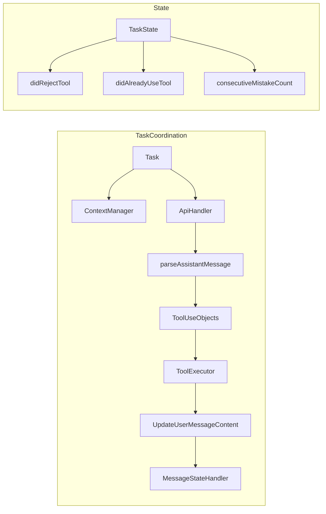

# Vector — Roblox Studio Copilot (Cline‑style tools, context, edits, and Asset Store)

> An implementation plan for a **Roblox Studio AI copilot** with a **Next.js** backend and an **LLM tool‑calling orchestrator**, refined to mirror Cline’s step‑by‑step tool usage, context management, and diff‑first editing.

---

## 0) What this is

* **Studio Plugin (Luau)**: docked chat + proposals, reads active editor state, previews diffs, applies edits inside **ChangeHistoryService**. Provider configuration is read from the backend `.env`.
* **Next.js Backend (TypeScript)**: `/api/chat`, `/api/stream`, `/api/proposals/:id/apply`, `/api/assets/search`, plus an orchestrator that exposes tools to the LLM across OpenRouter, Gemini, AWS Bedrock, and NVIDIA providers.
* **LLM Tool‑Calling**: one‑tool‑per‑message, approval‑first workflow (like Cline). The model proposes **proposals** (edits/object ops/asset ops); only the plugin performs writes after user approval. Supports provider selection among OpenRouter, Gemini, AWS Bedrock (Claude / Titan / Llama variants), and NVIDIA (NIM / OpenAI-compatible endpoints). Streaming includes clear indicators: `orchestrator.start …`, `tool.parsed <name>`, `tool.valid <name>`, `tool.result <name>`, `proposals.mapped <name> count=N`, `context.request <reason>`, and `error.*`. The console prints `[orch] provider.raw …` for every raw reply.
  - Ask mode UI: a single transcript shows assistant text bubbles and compact tool chips. Completion proposals are echoed as assistant text; in Auto mode proposals auto-apply and render as chips only.

### Recent Implementation Notes

Recent prompt and orchestrator changes aim to make *geometry-first* scene building smoother:

- The system prompt now nudges the model to plan before acting, list current instances, and iterate with `create_instance`/`set_properties` until visible results exist. Examples are illustrative only; they do not enforce specific content. The agent chooses relevant patterns (e.g., house) and must not introduce unrelated models (e.g., "Farm") unless explicitly requested.
- Geometry intent is detected heuristically, but we no longer hard-block scripting; the prompt + example policy keeps the agent in direct manipulation mode unless the user explicitly requests reusable Luau.
- Raw provider payloads are logged to the terminal via `[orch] provider.raw …`, which helps spot malformed XML/JSON immediately during runs.
- Tool results are now re‑fed to the model as `user` messages (not `system`), so the provider “remembers” context tool outputs (e.g., list_children) and stops claiming the workspace is empty. Paths: apps/web/lib/orchestrator/index.ts:1531, 1553.
- XML props tolerance: the orchestrator accepts `<props><Name>…</Name></props>` (nested tags) in addition to strict JSON. These are converted into an object before schema validation. Path: apps/web/lib/orchestrator/index.ts:498.
- Fenced JSON tolerance: ```json blocks are unwrapped before parsing so edits/arrays parse reliably. Path: apps/web/lib/orchestrator/index.ts:430–460.
- Auto‑create missing parents: when the model asks to create an Instance under `Workspace.<Name>` and that parent path doesn’t exist yet in the snapshot, the orchestrator automatically prepends a `create_instance(Model)` for the missing ancestor(s) under `game.Workspace` before the requested child. This enables prompts like “Create WallNorth under Workspace.Base …” in a single step, without manual selection. Path: apps/web/lib/orchestrator/index.ts around the `create_instance` mapping.
  - Scope: only under Workspace; creates a chain of missing Models (e.g., Workspace.Base.Structures → creates Base, then Structures, then your child).
  - Selection defaults still apply when no `parentPath` is provided.
- Optional text‑before‑tool: you may enable `VECTOR_ALLOW_TEXT_BEFORE_TOOL=1` to surface brief assistant prose before the single tool tag; set `VECTOR_ENFORCE_TOOL_AT_END=1` to warn on trailing prose after the tag.

Planning updates (detailed, tool‑oriented)
- The planner now expects a detailed, tool‑specific step list when work is non‑trivial. Steps should name the tool, the exact target (class/path/name), and the intention (e.g., position/size or script action).
- Typical plans are 8–15 steps, but there is no hard cap — the agent may use as many steps as needed to be clear and verifiable.
- Prefer assets first: plan search_assets → insert_asset for props/models, then arrange via set_properties; fall back to create_instance when catalog search is unavailable or insufficient.
- A Luau step is still required before completion (unless user opts out, e.g., “geometry only”).

### Plugin UI fixes

- Tooltip helper hoisted; nil call removed. The auto‑toggle tooltip no longer throws on hover. File: plugin/src/main.server.lua around 1316–1396.
- Proposal card guards: accessing `.Visible` is now guarded for potentially missing controls in the completion branch to avoid nil errors in renderProposals.

### Asset search/insert

- `GET /api/assets/search` is wired and defaults to Roblox catalog unless `CATALOG_API_URL` is set to a proxy. Results are normalized to `{ id, name, creator, type, thumbnailUrl }`. Paths: apps/web/app/api/assets/search/route.ts, apps/web/lib/catalog/search.ts.
- The plugin renders a result picker with Insert buttons that call `InsertService:LoadAsset(assetId)` and report back via `/api/proposals/:id/apply`.
 - Orchestrator bias: prefers `search_assets` → `insert_asset` over manual `create_instance` for non‑primitive content; will pivot to manual creation when `CATALOG_DISABLE_SEARCH=1`, no results, or insert errors are reported.
 - Fallback signals:
   - Server apply route records a system hint encouraging manual creation on asset failures.
   - Plugin auto‑continue appends a follow‑up message to build manually if insert failed (includes last error).

### Planning guidance (assets‑first, detailed)

Use a detailed <start_plan> with one tool per step, naming the action and target. Example (military base outline):

```
<start_plan>
  <steps>[
    "Create Model 'MilitaryBase' under game.Workspace",
    "Search assets query='watch tower' tags=['model'] limit=6",
    "Insert asset <ID_FROM_RESULTS> under game.Workspace.MilitaryBase",
    "Search assets query='barracks' tags=['model'] limit=6",
    "Insert asset <ID_FROM_RESULTS> under game.Workspace.MilitaryBase",
    "Search assets query='fence' tags=['model'] limit=6",
    "Insert asset <ID_FROM_RESULTS> under game.Workspace.MilitaryBase",
    "Set properties (Anchored, CFrame) to arrange towers, barracks, fence perimeter",
    "Open or create Script 'BaseBuilder' in game.ServerScriptService",
    "Show diff to add idempotent Luau that rebuilds the base"
  ]</steps>
</start_plan>
```

Notes
- Not capped: include as many steps as needed to place/arrange everything clearly.
- After inserts, use `set_properties` to anchor and position visible parts so progress is obvious in Workspace.
- If search/insert fails: continue with `create_instance` and place primitives, then add Luau before completing (unless opted out).


---

## 1) System prompt (Roblox‑focused, Cline‑style)

Use a short, strict, tool‑centric system prompt. Keep it **deterministic** and **proposal‑first**.

```
You are a Roblox Studio copilot. You read the active script, inspect selection,
and propose safe, undoable changes. You must use exactly ONE tool per message.
Wait for each tool result before the next step.

# Tool call format (XML-like):
<tool_name>
  <param1>…</param1>
  <param2>…</param2>
</tool_name>

# Available tools (see JSON schemas below)
- get_active_script()
- list_selection()
- list_open_documents(maxCount?)
- open_or_create_script(path, parentPath?, name?)
- start_plan(steps[])
- update_plan(completedStep?, nextStep?, notes?)
- list_children(parentPath, depth?, maxNodes?, classWhitelist?)
- get_properties(path, keys?, includeAllAttributes?, maxBytes?)
- show_diff(path, edits[])
- apply_edit(path, edits[])
- create_instance(className,parentPath,props)
- set_properties(path, props)
- search_assets(query,tags?,limit?)
- insert_asset(assetId,parentPath)

Parameter encoding
- For objects/arrays, the inner text MUST be strict JSON (double quotes; no trailing commas). Never wrap JSON in quotes. No code fences.
  - Right: `<props>{"Name":"Part","Anchored":true}</props>`
  - Wrong: `<props>"{\"Name\":\"Part\"}"</props>`

Rules:
- Never modify code or instances without an approved proposal.
- Keep context small; ask for more only when needed.
- Prefer minimal diffs and property deltas.
- Reference Roblox paths by canonical `GetFullName()`.
- Names should be alphanumeric/underscore only; avoid dots/slashes when creating new Instances.
- Existing special characters can be referenced with bracket segments: `game.Workspace["My.Part"]["Wall [A]"]`.
 - Selection defaults: when a single instance is selected in Studio, infer missing `path`/`parentPath` for common tools (rename/set/delete/create/insert) using that selection; otherwise default to `game.Workspace`.
 - Edit constraints: keep edits sorted and non‑overlapping; cap size (≤20 edits, ≤2000 inserted characters).
- Discovery defaults: when unsure where to act, use `list_open_documents`, `list_children`, `get_properties`, `list_code_definition_names`, and `search_files` before proposing edits.
- Each chat request now includes a bounded `scene` snapshot of `Workspace` (path/class/Name + basic props) so the orchestrator has a baseline for `list_children` / `get_properties`.
- Planning is mandatory: emit `<start_plan>` with an ordered step list before any action; use `<update_plan>` to mark progress/notes.
- Completion gate: every build that creates new geometry must also emit Luau code (Script/ModuleScript or repo `.lua/.luau`) so the structure can be rebuilt; the orchestrator blocks `<complete>` until that code exists.

### Embedded planning and examples

#### Examples policy (non-binding)
- Examples in the prompt are guidance only and must not be treated as commands.
- The agent should pick patterns that match the current goal or proceed without examples.
- Never introduce unrelated names/content from examples (e.g., do not create "FarmBuilder" when asked to build a house).

To keep `index.ts` concise, planner guidance and reference examples now live in:

- `apps/web/lib/orchestrator/prompts/examples.ts`
  - `PLANNER_GUIDE`: high-level planning heuristics for decomposing user goals
  - `QUALITY_CHECK_GUIDE`: checklist expectations that gate completion
  - `EXAMPLE_HOUSE_SMALL`: container + floor + four walls + roof sequence
  - `EXAMPLE_VEHICLE_CART`: chassis + wheel template
  - `EXAMPLES_POLICY`: examples are illustrative and non-binding; never introduce unrelated content from examples

`index.ts` concatenates these strings onto `SYSTEM_PROMPT` at build time, so the model sees them, while we keep the source organized.

### Ask-mode text and transcript
- The system supports `message(text, phase)` where phase is `start|update|final` for streaming-style text.
- The orchestrator emits `assistant.start`, `assistant.update`, and `assistant.final` stream lines. `final_message(text)` remains a shorthand that maps to a completion and emits `assistant.final`.
- The plugin renders this as a normal assistant text bubble in the single transcript alongside compact tool chips.

Roblox typed values (wrappers)
- Use `__t` wrappers for structured types in `props`:
  - Vector3 `{ "__t":"Vector3", "x":0, "y":1, "z":0 }`
  - Vector2 `{ "__t":"Vector2", "x":0, "y":0 }`
  - Color3 `{ "__t":"Color3", "r":1, "g":0.5, "b":0.25 }`
  - UDim `{ "__t":"UDim", "scale":0, "offset":16 }`
  - UDim2 `{ "__t":"UDim2", "x":{ "scale":0, "offset":0 }, "y":{ "scale":0, "offset":0 } }`
  - CFrame `{ "__t":"CFrame", "comps": [x,y,z, r00,r01,r02, r10,r11,r12, r20,r21,r22] }`
  - EnumItem `{ "__t":"EnumItem", "enum":"Enum.Material", "name":"Plastic" }`
  - BrickColor `{ "__t":"BrickColor", "name":"Bright red" }`
  - Instance ref `{ "__t":"Instance", "path":"game.ReplicatedStorage.Template" }`
- Attributes: prefix keys with `@`, e.g., `{ "@Health": 100 }`.
```

> Optional: **Plan vs Act** modes. In *Plan* mode, gather info and outline a plan. In *Act* mode, execute tools one step at a time.

---

## 2) Tool registry (JSON schema)

These are the server‑registered tools exposed to the LLM. Keep schemas strict and types narrow.

```json
{
  "tools": [
    {
      "name": "get_active_script",
      "description": "Return the current active script path and editor text.",
      "parameters": {"type": "object", "properties": {}, "required": []}
    },
    {
      "name": "list_selection",
      "description": "List current Selection with class/name/full path/properties.",
      "parameters": {"type": "object", "properties": {}, "required": []}
    },
    {
      "name": "list_open_documents",
      "description": "Return a small list of open ScriptDocuments (path, optional ranges).",
      "parameters": {"type": "object", "properties": {"maxCount": {"type": "integer", "minimum": 1, "maximum": 100}}, "required": []}
    },
    {
      "name": "show_diff",
      "description": "Preview text edits as a diff without applying.",
      "parameters": {
        "type": "object",
        "properties": {
          "path": {"type": "string"},
          "edits": {
            "type": "array",
            "items": {
              "type": "object",
              "properties": {
                "start": {"type": "object", "properties": {"line": {"type": "integer"}, "character": {"type": "integer"}}, "required": ["line", "character"]},
                "end":   {"type": "object", "properties": {"line": {"type": "integer"}, "character": {"type": "integer"}}, "required": ["line", "character"]},
                "text":  {"type": "string"}
              },
              "required": ["start", "end", "text"]
            }
          }
        },
        "required": ["path", "edits"]
      }
    },
    {
      "name": "apply_edit",
      "description": "Apply text edits to a script (plugin will do UpdateSourceAsync under ChangeHistory).",
      "parameters": {"$ref": "#/tools/3/parameters"}
    },
    {
      "name": "create_instance",
      "description": "Create an Instance and parent it.",
      "parameters": {
        "type": "object",
        "properties": {
          "className": {"type": "string"},
          "parentPath": {"type": "string"},
          "props": {"type": "object"}
        },
        "required": ["className", "parentPath"]
      }
    },
    {
      "name": "set_properties",
      "description": "Set properties on an existing instance by path.",
      "parameters": {
        "type": "object",
        "properties": {"path": {"type": "string"}, "props": {"type": "object"}},
        "required": ["path", "props"]
      }
    },
    {
      "name": "rename_instance",
      "description": "Rename an Instance by its full path.",
      "parameters": {
        "type": "object",
        "properties": {"path": {"type": "string"}, "newName": {"type": "string"}},
        "required": ["path", "newName"]
      }
    },
    {
      "name": "delete_instance",
      "description": "Delete an Instance by its full path.",
      "parameters": {
        "type": "object",
        "properties": {"path": {"type": "string"}},
        "required": ["path"]
      }
    },
    {
      "name": "search_assets",
      "description": "Search the Roblox catalog for assets (server-side).",
      "parameters": {
        "type": "object",
        "properties": {"query": {"type": "string"}, "tags": {"type": "array", "items": {"type": "string"}}, "limit": {"type": "integer", "minimum": 1, "maximum": 50}},
        "required": ["query"]
      }
    },
    {
      "name": "insert_asset",
      "description": "Insert a catalog asset by ID under a parent path.",
      "parameters": {
        "type": "object",
        "properties": {"assetId": {"type": "integer"}, "parentPath": {"type": "string"}},
        "required": ["assetId"]
      }
    }
  ]
}
```

> **show\_diff** and **apply\_edit** share the same shape; **show\_diff** never writes.

---

## 3) Context gathering (plugin → backend)

**Plugin capture (Luau)**

```lua
local Selection = game:GetService("Selection")
local ScriptEditorService = game:GetService("ScriptEditorService")
local StudioService = game:GetService("StudioService")

local function getActiveScriptContext()
    local active = StudioService.ActiveScript
    if not active then return nil end
    return { path = active:GetFullName(), text = ScriptEditorService:GetEditorSource(active) }
end

local function getSelectionContext()
    local out = {}
    for _, inst in ipairs(Selection:Get()) do
        table.insert(out, { className = inst.ClassName, name = inst.Name, path = inst:GetFullName() })
    end
    return out
end
```

**Backend receive**

```ts
// app/api/chat/route.ts
export const runtime = 'nodejs'
import { z } from 'zod'
import { runLLM } from '@/lib/orchestrator'

const ChatSchema = z.object({
  projectId: z.string(),
  message: z.string(),
  context: z.object({
    activeScript: z.object({ path: z.string(), text: z.string() }).nullable().optional(),
    selection: z.array(z.object({ className: z.string(), path: z.string() })).optional(),
    openDocs: z.array(z.object({ path: z.string() })).optional(),
    scene: z.object({
      nodes: z.array(z.object({
        path: z.string(),
        className: z.string(),
        name: z.string(),
        parentPath: z.string().optional(),
        props: z.record(z.unknown()).optional(),
      })).optional(),
    }).optional(),
  }),
  autoApply: z.boolean().optional()
})

export async function POST(req: Request) {
  const input = ChatSchema.parse(await req.json())
  const { proposals, taskState } = await runLLM(input) // proposals + TaskState snapshot
  return Response.json({ proposals, taskState })
}
```

**Auto‑compaction (orchestrator)**

* Track tokens (`tokensIn + tokensOut + cacheWrites + cacheReads`) and `contextRequests`.
* If near the model window, summarise & truncate older turns (prefer keeping the latest + a summarized history). Store telemetry for debugging.

---

## 4) Editing workflow (diff‑first, approval‑first)

**End‑to‑end**

1. LLM returns **proposals** (e.g., `type: 'edit' | 'object_op' | 'asset_op'`).
2. Plugin shows diffs/ops → **Approve** or **Reject**.
3. On approve: plugin wraps writes in `ChangeHistoryService:TryBeginRecording` / `FinishRecording` and performs:

   * Text edits: `ScriptEditorService:UpdateSourceAsync` with a transform function.
   * Object ops: `Instance.new`, set properties.
4. Plugin reports the result back to `/api/proposals/:id/apply` for auditing.

**Apply edit (Luau)**

```lua
local ScriptEditorService = game:GetService("ScriptEditorService")
local ChangeHistoryService = game:GetService("ChangeHistoryService")

local function applyEdit(scriptInstance, transformFn)
    if not ChangeHistoryService:TryBeginRecording("AI Edit", "AI Edit") then return false end
    local ok, err = pcall(function()
        ScriptEditorService:UpdateSourceAsync(scriptInstance, function(old)
            return transformFn(old)
        end)
    end)
    ChangeHistoryService:FinishRecording("AI Edit")
    return ok, err
end
```

**UX details (Cline‑style)**

* Always render a **diff preview** and require approval before saving.
* When rejected, **reset** the preview state (no write).
* One approved apply = one **meaningful undo step**.

---

## 5) Asset Store integration (search → insert → post‑configure)

**Server (Next.js)**

* `GET /api/assets/search?query=…&tags=…&limit=…` — Catalog search (server‑side). Also accepts legacy `q` as alias for `query`. Normalize results to `{ id, name, creator, type, thumbnailUrl }`.
  - Env: `CATALOG_API_URL` (required for real results). If unset, returns stubbed results during local dev.
  - Env: `CATALOG_API_KEY` (optional) — sent as `Authorization: Bearer <key>` when present.
* Optionally cache by `query` and tags.

**Plugin (Luau)**

```lua
local InsertService = game:GetService("InsertService")

local function insertAsset(assetId, parent)
    local container = InsertService:LoadAsset(assetId) -- returns a Model
    local model = container
    local childModel = container and container:FindFirstChildOfClass("Model")
    if childModel then model = childModel end
    model.Parent = parent or workspace
    return model
end
```

**LLM flow**

* `search_assets(query, tags?)` → assistant proposes a short pick list.
* On user choice, assistant emits `insert_asset(assetId,parentPath)` → plugin inserts → assistant follows with `set_properties` / `apply_edit` to wire scripts.

**Permissions**

* The **plugin** calls your backend domain only (user approves once via the built‑in HTTP permission prompt). The backend talks to Roblox’s web APIs.

---

## 5a) 3D Generation (Meshy)

- Endpoint: `POST /api/assets/generate3d` now proxies to Meshy’s text-to-3D API.
- Auth: uses `Authorization: Bearer <key>` from the request header (sent by the Studio plugin) or `MESHY_API_KEY` env on the backend.
- Config: `MESHY_API_URL` (default `https://api.meshy.ai/openapi/v2/text-to-3d`), `MESHY_TIMEOUT_MS`.
- Plugin: Settings adds “Meshy API Key (3D Generation)” and sends it as a bearer header when enqueuing jobs.
- Response: `{ jobId, provider: 'meshy' }` (job status/polling can be added next).

Note: For local dev, set `MESHY_API_KEY` in `vector/apps/web/.env.local`. Later we can add secure server-side storage for multi-user deployments.

---

## 6) Streaming & transport

* **Plugin**: default to **short polling** or **long‑polling** `/api/stream?cursor=…`. If SSE is available and reliable in your environment, the plugin can use it; otherwise keep long‑poll. The stream store periodically cleans idle workflows to control memory.
* **Web dashboard**: use SSE for token‑level streaming.
* Limit concurrent plugin HTTP requests (≤2) to avoid Studio’s in‑flight cap.

---

## 7) Safety & permissions

* **Script writes** only inside **ChangeHistoryService** recordings.
* **ScriptEditorService** only for reading/writing code (never touch `Script.Source` directly).
* **Two prompts** the first time: HTTP domain(s) and Script Modification.
* **Dry‑run mode**: preview diffs, no writes.
* **Audit**: store prompts, tool calls, proposals, final diffs, and outcomes.

---

## 8) Next.js orchestrator (TypeScript)

```
/lib/orchestrator/
  index.ts              // provider-agnostic run()
  providers/openai.ts   // function-calling adapter
  providers/anthropic.ts// tool-use adapter
  context.ts            // token tracking + summarization
  proposals.ts          // build proposals from tool calls
  tools.ts              // registry + zod schemas
```

**Key responsibilities**

* Load **system prompt** + **tool registry**.
* Maintain conversation context; summarise before overflow.
* Normalize tool calls → **proposals** (edit/object/asset).
* Persist proposals; expose to plugin.

---

## 9) UI sketches (plugin)

* **Chat**: messages, partial streaming rows, status (generating/applying/failed).
* **Context chips**: *Active Script*, *Selection*, *Open Docs* (click to attach as tags into the next prompt).
* **Proposals**: diff/ops list with **Apply**, **Apply & open file**, **Reject**.

---

## 10) Mermaid: full data flow

```mermaid
flowchart TD
    subgraph Studio Plugin (Luau)
        A[User asks] --> B[Collect context\nGetEditorSource + Selection]
        B --> C[/api/chat]
        J[Stream/Long-poll /api/stream] --> K[Render partial tokens]
        C -->|proposals| D[Diff/Operations UI]
        D --> E{Approve?}
        E -- Yes: edits --> F[TryBeginRecording\nUpdateSourceAsync\nFinishRecording]
        E -- Yes: assets --> G[InsertService:LoadAsset]
        F --> H[Report success]
        G --> H
        E -- No --> I[Reject]
    end

    subgraph Backend (Next.js)
        C --> L[LLM Orchestrator]
        L --> M[System prompt + Tool registry]
        M --> N[Model tool-call]
        N --> O[Proposal Builder]
        O --> C
        P[/api/assets/search/] --> Q[Catalog APIs]
        Q --> P --> L
        H --> R[Mark proposal applied]
    end

    subgraph Context Manager
        L --> S[Token accounting]
        S --> T{Near window?}
        T -- yes --> U[Summarize + truncate]
        U --> L
    end
```

---

## 11) Milestones (updated)

**M0 — Spike (1–2 days)**

* Dock widget + toolbar; read active script + selection; POST `/api/chat`; echo back.

**M1 — Edits (1–2 weeks)**

* Implement `show_diff` + `apply_edit` end‑to‑end with preview & single undo step.
* Error surfaces for unsaved edits / Team Create conflicts.

**M2 — Instances & properties (1–2 weeks)**

* `create_instance`, `set_properties` with selection chips → apply.

**M3 — Asset Store (1 week)**

* `/api/assets/search` + plugin picker + `insert_asset` + post‑configure script stubs.

**M4 — Orchestrator & Providers (1–2 weeks)**

* Tool adapters for OpenAI/Anthropic; deterministic JSON parsing; auto‑compaction.

**M5 — (Optional) Indexing**

* Snapshot route + luau‑lsp diagnostics + embeddings for retrieval.

---

## 12) Testing & observability

* **Localhost first** (`http://127.0.0.1:3000`) to trigger plugin HTTP permission.
* **Concurrency guard** (≤2 in‑flight requests) in the plugin.
* **Undo/redo**: every approved apply == one undo step.
* **Audit logs**: verify tool calls/proposals/diffs persisted.

---

## 13) Appendix: minimal code stubs

**Next.js tool registry (zod)**

```ts
// lib/tools.ts
import { z } from 'zod'

export const EditRange = z.object({ line: z.number(), character: z.number() })
export const Edit = z.object({ start: EditRange, end: EditRange, text: z.string() })

export const Tools = {
  get_active_script: z.object({}),
  list_selection: z.object({}),
  list_open_documents: z.object({ maxCount: z.number().min(1).max(100).optional() }),
  show_diff: z.object({ path: z.string(), edits: z.array(Edit) }),
  apply_edit: z.object({ path: z.string(), edits: z.array(Edit) }),
  create_instance: z.object({ className: z.string(), parentPath: z.string(), props: z.record(z.any()).optional() }),
  set_properties: z.object({ path: z.string(), props: z.record(z.any()) }),
  search_assets: z.object({ query: z.string(), tags: z.array(z.string()).optional(), limit: z.number().min(1).max(50).optional() }),
  insert_asset: z.object({ assetId: z.number(), parentPath: z.string().optional() })
}
```

**Plugin request helper (Luau)**

```lua
local HttpService = game:GetService("HttpService")

local function postJson(url, body)
    return HttpService:RequestAsync({
        Url = url,
        Method = "POST",
        Headers = { ["Content-Type"] = "application/json" },
        Body = HttpService:JSONEncode(body)
    })
end
```

— end —

# 0a) Runtime split (Vercel‑hosted backend ↔ Studio plugin)

Below shows exactly **where each part runs** and **who is allowed to edit the scene/code**. The backend is the brain (planning, LLM tool orchestration, asset search/generation); the plugin is the hands (reads context, previews diffs, applies edits with undo/redo).

```mermaid
flowchart LR
    subgraph User_Studio["Roblox Studio (user)"]
        U[Developer types in chat] --> PUI[Plugin Chat UI]
    end

    subgraph Plugin["Studio Plugin (Luau)"]
        PUI --> CTX[Collect Context<br/>GetEditorSource • Selection • Open Docs]
        CTX --> REQ[HTTPS POST /api/chat]
        DIFFS[Diffs / Ops Preview] --> APPROVE{Approve?}
        APPROVE -- Yes: edits --> APPLY[ChangeHistoryService<br/>UpdateSourceAsync]
        APPROVE -- Yes: assets --> INSERT[InsertService:LoadAsset → set_properties]
        APPLY --> ACK[POST /api/proposals/:id/apply]
        INSERT --> ACK
        APPROVE -- No --> REJECT[Reject]
    end

    subgraph Backend["Next.js Orchestrator (Vercel)"]
        ROUTES[/api/chat • /api/stream* • /api/assets/search • /api/proposals/:id/apply/]
        ORCH[Tool‑Calling Orchestrator]
        PROVIDERS[OpenRouter / OpenAI / Anthropic]
        STORE[(DB • Cache • Audit Logs)]
        GEN3D[/api/assets/generate3d]
        GPU[GPU 3D Asset Gen Service]
    end

    subgraph Roblox_APIs["Roblox APIs"]
        CATALOG[Catalog/Marketplace Search]
        OPENCLOUD[Open Cloud Upload → assetId]
    end

    REQ --> ROUTES
    ROUTES --> ORCH --> PROVIDERS
    ORCH --> STORE
    ORCH -->|proposals JSON| DIFFS
    GEN3D --> GPU --> OPENCLOUD --> ORCH
    ROUTES --> CATALOG

    %% Notes: * Studio plugins cannot use SSE/WebSockets. Use short/long‑polling.
```

**Key points**

* **Only the plugin** can edit Roblox code/scene. The backend **never writes** to the place; it returns **proposals** (diffs, instance/property ops).
* First call to your domain (e.g. Vercel) triggers Studio’s **HTTP domain permission** prompt; first write triggers **Script Modification** permission.
* **Streaming inside Studio**: use long‑polling (`/api/stream`). A separate SSE route (`/api/stream/sse`) is available for dashboards.
* **Asset flows**: search via backend → propose → `InsertService:LoadAsset(assetId)` in plugin → optional `set_properties`.
* **3D generation**: backend calls GPU service → uploads via **Open Cloud** → returns `assetId` → plugin inserts.

**Minimal tool call snippet (for clarity)**

```
You are a Roblox Studio copilot. You read the active script, inspect selection,
and propose safe, undoable changes. You must use exactly ONE tool per message.
Wait for each tool result before the next step.

# Tool call format (XML‑like):
<tool_name>
  <param1>…</param1>
  <param2>…</param2>
</tool_name>
```

# 1) Tool registry & schemas (Cline‑style, Roblox‑native)

**One‑tool‑per‑message. Always preview before apply. All writes are inside `ChangeHistoryService`.**

### Call format the model must use

```
You are a Roblox Studio copilot. You read the active script, inspect selection,
and propose safe, undoable changes. You must use exactly ONE tool per message.
Wait for each tool result before the next step.

# Tool call format (XML‑like):
<tool_name>
  <param1>…</param1>
  <param2>…</param2>
</tool_name>
```

### Context tools

| Tool                          | Purpose                                 | Params        | Returns                              | Runs where    |
| ----------------------------- | --------------------------------------- | ------------- | ------------------------------------ | ------------- |
| `get_active_script()`         | Read active editor tab content reliably | —             | `{ path, text, isDirty }`            | Plugin (Luau) |
| `list_open_documents(maxCount?)` | Enumerate open `ScriptDocument`s     | `maxCount?`   | `[{ path, isDirty }]`                | Plugin        |
| `open_or_create_script(path,parentPath?,name?)` | Guarantee a Script exists and return its Source | `path` or `parentPath`+`name` | `{ path, text, created }` | Backend → proposal + plugin |
| `start_plan(steps[])`            | Declare ordered steps before acting    | `steps[]`      | `{ steps }`                          | Orchestrator  |
| `update_plan(completedStep?,nextStep?,notes?)` | Track plan progress / notes           | `completedStep?, nextStep?, notes?` | `{ completedStep?, nextStep?, notes? }` | Orchestrator |
| `list_selection()`            | Current Selection metadata              | —             | `[{ className, name, path, props }]` | Plugin        |
| `list_children(path)`         | Explore hierarchy under a node          | `path`        | `[{ className, name, path }]`        | Plugin        |
| `get_properties(path, keys?)` | Read specific props for an Instance     | `path, keys?` | `{ key:value }`                      | Plugin        |

#### Context tool implementation notes

`get_properties` and `list_children` now appear in the backend tool registry, so the provider can call them just like any other context helper. The Studio plugin still executes them, but the orchestrator serves responses from the cached `TaskState` scene graph (hydrated after each apply/object proposal) so retries stay deterministic and sandboxes remain read-only.

- `get_properties(path, keys?, includeAllAttributes?, maxBytes?)`
  - Purpose: Read selected properties and/or attributes of an Instance at `path`.
  - Params:
    - `path` (string, required) — canonical `GetFullName()` path
    - `keys` (string[], optional) — property names; entries beginning with `@` fetch attributes
    - `includeAllAttributes` (boolean, optional) — return every attribute when true
    - `maxBytes` (number, optional) — server clamp; defaults to 32768 bytes
  - Returns: object map of requested fields with JSON-safe typed wrappers
  - Constraints: respects `maxBytes`; unknown properties are skipped instead of raising
  - Example:
    ```
    <get_properties>
      <path>game.Workspace.Tree</path>
      <keys>["Position","Size","Anchored","@Health"]</keys>
    </get_properties>
    ```

- `list_children(parentPath, depth?, maxNodes?, classWhitelist?)`
  - Purpose: Explore a subtree under `parentPath`, returning class/name/path triples.
  - Params mirror the schema; `classWhitelist` expects an object like `{ "Part": true }`.
  - Returns: `[{ path, name, className, children?[] }]`
  - Constraints: respects depth/maxNodes caps; falls back to the cached scene graph when Studio hasn’t returned new data yet.
  - Example:
    ```
    <list_children>
      <parentPath>game.Workspace.House</parentPath>
      <depth>2</depth>
      <classWhitelist>{"Part":true,"Model":true}</classWhitelist>
    </list_children>
    ```

### Editing tools (scripts & instances)

| Tool                                            | Purpose                        | Params                           | Returns                         | Runs where |
| ----------------------------------------------- | ------------------------------ | -------------------------------- | ------------------------------- | ---------- |
| `show_diff(path, edits[])`                      | Render diff preview (no write) | `path, edits[]` line/char ranges | `{ previewId }`                 | Plugin     |
| `apply_edit(path, edits[])`                     | Apply text edits with undo     | `path, edits[]`                  | `{ ok, beforeHash, afterHash }` | Plugin     |
| `create_instance(className, parentPath, props)` | Create & parent                | `className, parentPath, props`   | `{ path }`                      | Plugin     |
| `set_properties(path, props)`                   | Mutate props                   | `path, {key:value}`              | `{ ok }`                        | Plugin     |
| `rename_instance(path, newName)`                | Rename                         | `path, newName`                  | `{ path }`                      | Plugin     |
| `delete_instance(path)`                         | Delete safely                  | `path`                           | `{ ok }`                        | Plugin     |

### Asset Store & generation tools

| Tool                                                | Purpose                           | Params                           | Returns                                      | Runs where        |
| --------------------------------------------------- | --------------------------------- | -------------------------------- | -------------------------------------------- | ----------------- |
| `search_assets(query, tags?, limit?)`               | Search Roblox Catalog/Marketplace | `query, tags?, limit?`           | `[{ assetId, name, type, thumbnailUrl }]`    | Backend (Next.js) |
| `insert_asset(assetId, parentPath)`                 | Insert by id                      | `assetId, parentPath`            | `{ insertedPaths[] }`                        | Plugin            |
| `generate_asset_3d(prompt, tags?, style?, budget?)` | GPU 3D gen → Open Cloud upload    | `prompt, tags?, style?, budget?` | `{ assetId, name, polyCount, thumbnailUrl }` | Backend + GPU     |

### Analysis/CI tools (backend jobs)

| Tool                                | Purpose                        | Params                   | Returns                         | Runs where       |
| ----------------------------------- | ------------------------------ | ------------------------ | ------------------------------- | ---------------- |
| `analyze_luau(snapshotId?, files?)` | Run `luau-lsp analyze`         | `snapshotId? or files[]` | `{ diagnostics[] }`             | Backend          |
| `run_tests(testPattern?)`           | Run TestEZ in runner container | `testPattern?`           | `{ passed, failed, reportUrl }` | Backend          |
| `snapshot_project()`                | Gzip editor state for analysis | —                        | `{ snapshotId, size }`          | Plugin → Backend |

> **Mapping to Cline**: `read_file` → `get_active_script`; `write_to_file/replace_in_file` → `apply_edit`; `list_files/search_files` → `list_children` + `list_selection`; `execute_command/browser_action` → **backend jobs** (`analyze_luau`, `search_assets`, `generate_asset_3d`).

---

# 2) Result types & formatting (what users see)

The backend returns **Proposals**. The plugin formats them into the chat + a side panel (diff or op cards) and asks for **Approve/Reject**. After execution, it writes a compact status to the chat.

### Proposal types

* `edit` — `{ path, diff:{mode:"rangeEDITS", edits:[{start:{line,character}, end:{line,character}, text}]}, notes? }`
* `object_op` — `ops:[ { op:"create_instance"|"set_properties"|"rename_instance"|"delete_instance", ... } ]`
* `asset_op` — `search:{ query,tags,limit }` or `insert:{ assetId,parentPath }` or `generate3d:{ prompt,.. }`

### Output formatter (Cline‑style)

* `toolResult(proposalId, summary)` → message block with ✅ and a compact table of changes
* `toolError(proposalId, error)` → 🔴 error with actionable hint
* `toolDenied(proposalId, reason)` → 🚫 user rejected
* Specialized:

  * `fileEditWithUserChanges(path, userEditsDiff)` (if user tweaks the diff before save)
  * `formatAssetsList(results[])` (grid of asset cards with thumbnails)

```mermaid
flowchart TB
  subgraph ResponseTypes[Response Types]
    A[Successful Tool Result] --> B[formatResponse.toolResult()]
    C[Tool Error] --> D[formatResponse.toolError()]
    E[User Denied Tool] --> F[formatResponse.toolDenied()]
    G[Specialized Formats] --> H[formatResponse.fileEditWithUserChanges()]
    G --> I[formatResponse.formatAssetsList()]
  end
  B --> J[User Message Content]
  D --> J
  F --> J
  H --> J
  I --> J
```

**Chat examples**

* *After previewing an edit*: “Proposed **2 line changes** to `Workspace.Button.Script` (replacing Touched with ProximityPrompt).” → \[Approve] \[Open Diff]
* *After apply*: “✅ Applied edit to `Workspace.Button.Script`. 1 undo step created.”
* *Asset search*: grid of up to 12 items with thumbnail, name, `Insert` buttons.

---

# 3) Minimal Luau handlers (short, illustrative)

```lua
-- get_active_script()
local StudioService = game:GetService("StudioService")
local ScriptEditorService = game:GetService("ScriptEditorService")
return function()
    local s = StudioService.ActiveScript
    if not s then return { path = nil, text = nil, isDirty = false } end
    local ok, src = pcall(function() return ScriptEditorService:GetEditorSource(s) end)
    return { path = s:GetFullName(), text = ok and src or "", isDirty = true }
end
```

```lua
-- apply_edit(path, edits[])  (single waypoint)
local ChangeHistoryService = game:GetService("ChangeHistoryService")
local ScriptEditorService = game:GetService("ScriptEditorService")
return function(scriptInstance, edits)
    if not ChangeHistoryService:TryBeginRecording("AI Edit", "AI Edit") then
        return { ok = false, error = "Cannot start recording" }
    end
    local ok, err = pcall(function()
        ScriptEditorService:UpdateSourceAsync(scriptInstance, function(old)
            -- assume edits already merged server‑side to one final text
            return edits.__finalText or old
        end)
    end)
    ChangeHistoryService:FinishRecording("AI Edit")
    return { ok = ok, error = err }
end
```

```lua
-- insert_asset(assetId, parentPath)
local InsertService = game:GetService("InsertService")
return function(assetId, parent)
    local model = InsertService:LoadAsset(assetId)
    model.Parent = parent
    return { insertedPaths = { model:GetFullName() } }
end
```

> **Note**: Production code should resolve `path → Instance`, validate classes/props, and merge multiple text edits to final source before `UpdateSourceAsync`.

---

# 4) Next.js API (thin orchestrator skeleton)

```ts
// app/api/chat/route.ts
export const runtime = 'nodejs'
import { z } from 'zod'
import { runLLM } from '@/lib/orchestrator'
const Chat = z.object({
  projectId: z.string(),
  message: z.string(),
  context: z.object({
    activeScript: z.object({ path: z.string(), text: z.string() }).nullable(),
    selection: z.array(z.object({ className: z.string(), path: z.string() })).optional(),
  }),
  autoApply: z.boolean().optional()
})
export async function POST(req: Request) {
  const input = Chat.parse(await req.json())
  const { proposals, taskState } = await runLLM(input) // proposals + TaskState metadata
  return Response.json({ proposals, taskState })
}
```

```ts
// lib/tools/schemas.ts (JSON Schema-ish)
export const tools = {
  apply_edit: {
    params: {
      path: 'string',
      edits: [{ start: { line: 'int', character: 'int' }, end: { line: 'int', character: 'int' }, text: 'string' }],
    },
  },
  create_instance: { params: { className: 'string', parentPath: 'string', props: 'record' } },
  set_properties: { params: { path: 'string', props: 'record' } },
  rename_instance: { params: { path: 'string', newName: 'string' } },
  delete_instance: { params: { path: 'string' } },
  search_assets: { params: { query: 'string', tags: ['string?'], limit: 'int?' } },
  insert_asset: { params: { assetId: 'number', parentPath: 'string' } },
}
```

```ts
// app/api/assets/search/route.ts
export async function GET(req: Request) {
  const { searchParams } = new URL(req.url)
  const query = searchParams.get('q') || ''
  const limit = Number(searchParams.get('limit') || '8')
  // Call Roblox catalog via your server integration
  const results = await searchRobloxCatalog(query, limit)
  return Response.json({ results })
}
```

```ts
// app/api/assets/generate3d/route.ts (GPU job)
export async function POST(req: Request) {
  const { prompt } = await req.json()
  const jobId = await enqueue3DJob(prompt)
  return Response.json({ jobId })
}
```

---

# 5) System prompt (final excerpt)

```
You are Vector, a Roblox Studio copilot.

Operating mode
- Proposal-first: never write to code or instances directly. Always propose edits/ops; the plugin applies them only after user approval.
- One tool per message: emit exactly one tool call per assistant turn; wait for the tool result before the next step.
- Keep context small: request only the minimum context via tools (get_active_script, list_selection, list_open_documents, `list_code_definition_names`, `search_files`) when needed; prefer `@file/@folder/@url` mentions for explicit attachments.

Tool call format (XML-like; one per message)
<tool_name>
  <param1>...</param1>
  <param2>...</param2>
</tool_name>

Editing rules
- Scripts: propose edit with diff.mode="rangeEDITS" using zero-based {line,character} positions.
- Preview before apply: first request show_diff(path, edits[]); after user approval, request apply_edit(path, edits[]).
- Instances: propose object_op with minimal operations (create_instance, set_properties, rename_instance, delete_instance). Use canonical Instance:GetFullName() paths.
- Assets: search_assets -> present shortlist; on user choice -> insert_asset -> optionally set_properties.

Safety
- All writes occur in the plugin inside ChangeHistoryService recordings.
- Use ScriptEditorService APIs to read/write source (never touch Script.Source directly).
- Prefer minimal diffs and property deltas. Never perform broad rewrites without explicit instruction.

Good behavior
- Ask for missing context only when required.
- Reference paths and names precisely; avoid ambiguity.
- If a proposal could be large, stage it into multiple small, reviewable proposals.

Output expectations
- Return concise, actionable proposals:
  - edit: { path, diff:{ mode:"rangeEDITS", edits:[...] }, notes? }
  - object_op: { ops:[ { op:"...", ... } ], notes? }
  - asset_op: { search:{...} | insert:{...}, notes? }

Plan vs Act (optional)
- Plan: outline a short plan and which tool you will call next.
- Act: issue one tool call, wait for result, then continue.
```

---

# 6) Plan/Act loop & state



**Behavior**

* Plan Mode (optional): multi‑step plan cards → user toggles to Act Mode
* Act Mode: one tool → preview → Approve/Reject → apply → audit

---

# 7) File structure (monorepo)

```
vector/
  apps/
    web/                # Next.js (Vercel)
      app/api/chat/route.ts
      app/api/assets/search/route.ts
      app/api/assets/generate3d/route.ts
      app/api/proposals/[id]/apply/route.ts
      lib/orchestrator/
      lib/tools/schemas.ts
    dashboard/          # optional web UI with SSE
  packages/
    shared/             # zod schemas, types
    orchestrator/       # provider adapters (OpenRouter/OpenAI/Anthropic/local)
    diff/               # text edit merging utilities
  plugin/               # Roblox Studio plugin (Luau)
    src/
      ui/
      net/
      tools/            # Luau handlers for tools above
      services/
      main.server.lua   # toolbar + dock widget bootstrap
    rojo.json
    selene.toml
    stylua.toml
  infra/                # GPU jobs, queues, Open Cloud uploader
  README.md
  Vector.md
```

**Style/linting**

* **Luau**: Selene + Stylua
* **TS**: ESLint + Prettier

---

# 8) Safety & permissions

* First network call to your domain prompts **HTTP permission**.
* First write prompts **Script Modification permission**.
* All writes inside **ChangeHistoryService** for undo/redo.
* Asset insertion only from **approved assetIds**; surface thumbnails & creators.
* No Roblox web endpoints from plugin; all via your backend.

---

# 9) Big‑ask behavior (e.g., “make a Jailbreak‑like game”)

* The model emits a **scaffold plan** → proposals in stages (map → vehicles → roles → GUIs → gameplay scripts).
* Every stage is previewed and requires approval; nothing overwrites silently.
* Optional: long jobs (3D gen, analysis) return jobIds; plugin polls `/api/jobs/:id`.

---

# 10) Deliverables checklist for M1

- Docked chat UI, context capture, HTTP permission flow — implemented
- `/api/chat` round-trip producing `edit` and `object_op` proposals — implemented
- Diff preview + one-click **Apply** (single undo step) — full unified diff renderer implemented; shows context, additions/deletions, multiple hunks, with Open/Close Diff toggle
- Asset search + insert flow — implemented (server stub + plugin Browse + Insert)
- Audit log of proposals and outcomes — implemented with file-backed JSON durability and apply acknowledgements

---

## Implementation Progress — 2025-08-31 (updated @ 21:06 UTC)

Recent updates

- 2026-07: Hardened provider selection — deterministic chooser between OpenRouter, Gemini, AWS Bedrock, and NVIDIA (`VECTOR_DEFAULT_PROVIDER`, override precedence, env fallbacks). Added Bedrock adapter (InvokeModel) & NVIDIA adapter (OpenAI-compatible). Gemini client safety checks (empty/safety finishes fail fast), sanitized catalog logging, and prompt guidance for manual scene creation when catalog search stubs out.
- 2026-07: Shipped checkpoint snapshots/restore, diff3-powered multi-file apply + conflict hunks, and the TaskState-driven progress UI (per-message auto checkpoints, manual Snapshot/Restore buttons in the plugin, run badges, token telemetry, and streamed conflict previews).
- 2026-06: Composer UI rebuilt to match reference mockup (attachment chips, inline auto toggle, model selector, quick menu) and auto mode now auto-inserts catalog assets.
- 2026-06: Model override pipeline added (`modelOverride` from plugin → API → orchestrator) with Gemini 2.5 Flash option in the Studio UI.
- 2026-06: Implementation plan refreshed into Today/Next/This Week checklist (linting, atomic persistence, TaskState, auto-approval, checkpoints, diff upgrades, streaming, context, resilience, plugin UX, code tools).
- 2026-06: ESLint config checked in; `npm run lint` now uses `eslint --max-warnings=0` and runs automatically before builds.
- 2026-06: JSON persistence now journaled — `persist.ts` replays unapplied entries on boot and writes data via atomic temp-rename.
- 2026-06: TaskState snapshots stored in `taskStates.json`; `/api/chat` returns `{ proposals, taskState }` with history, tool runs, and streaming status.
- 2026-06: Mention attachments & code discovery — prompts can use `@file/@folder/@url/@problems`, new read-only tools (`list_code_definition_names`, `search_files`) expose project structure, OpenRouter retries use exponential backoff, and missing-context tools trigger automatic `CONTEXT_REQUEST` retries.
- Added zod-based validation of provider tool-call arguments before mapping to proposals
- Added Plan/Act scaffold: executes context tools locally and performs a second provider call for the next actionable tool
- Switched proposals store to file-backed JSON durability (apps/web/data/proposals.json)
- Catalog provider interface via CATALOG_API_URL — no stub fallback; explicit 502 errors on failure
- Server-side diff preview shaping (unified diff) added to edit proposals; plugin renders preview snippet
- Provider errors now surfaced (no fallback when provider is configured via Settings); errors bubble to plugin UI

Next focus (July 2026)

- Conversation summarisation & guardrails — compact long histories, add safety prompts, and expose conversation caps so the agent stays within token limits.
- Analysis/CI jobs and durable persistence — promote JSON stores to a durable DB layer, add `analyze_luau`/`run_tests` workflow steps, and surface job status in the progress panel.
- UX polish — advanced chat shortcuts (Ask presets, slash commands), web dashboard for browsing proposals/history, and asset thumbnail proxying to complement the new progress HUD.

Decisions captured

- AI name: Vector (assistant name in UI and comments)
- LLM providers: OpenRouter (default), Gemini, AWS Bedrock, NVIDIA. `VECTOR_DEFAULT_PROVIDER`, plugin overrides, and env keys decide which client runs each request; unavailable creds automatically skip a provider.
- Package manager: npm
- Hosting: Local dev at http://127.0.0.1:3000 for now. We will move to Vercel (or similar) later.
- Domain permissions: local-only for now; will add hosted domain later when deploying.
- Plugin install workflow: Rojo during development → export .rbxm for small tester group → publish to Marketplace for public release.
- System prompt: refined Vector prompt (one-tool-per-message, proposal-first, minimal diffs).

Working now

- Web (Next.js + npm)
  - Local app scaffold (Next 14) with npm scripts; landing page at /.
  - API routes wired: /api/chat persists proposals to a file-backed store for auditing, returns `{ proposals, taskState }`, and accepts `autoApply` to mirror the Studio Auto toggle; /api/proposals/[id]/apply records an audit event; /api/proposals (GET) lists stored proposals; /api/assets/search calls a Catalog provider (falls back to stub data if `CATALOG_API_URL` unset); /api/assets/generate3d returns a stub jobId.
  - Provider tool-call parsing (OpenRouter) behind flags or per-request Settings: model outputs exactly one XML-like tool call which is parsed and mapped to proposals. Arguments validated with zod; when provider is configured, errors are surfaced (no fallback).
  - Multi-turn Plan/Act: executes context tools locally (get_active_script, list_selection, list_open_documents, `list_code_definition_names`, `search_files`), ingests `@file/@folder/@url/@problems` mentions, auto-compacts history, and continues up to `VECTOR_MAX_TURNS` (default 4) until an actionable tool is emitted. When required context is missing, the orchestrator emits a single `CONTEXT_REQUEST …` prompt before retrying.
  - Provider adapters present: openrouter.ts (call path), openai.ts (stub).
  - Timeouts & retries: provider calls honor `OPENROUTER_TIMEOUT_MS` (default 30000ms) and retry with backoff (`OPENROUTER_MAX_RETRIES`, `OPENROUTER_RETRY_DELAY_MS`, `OPENROUTER_RETRY_MAX_MS`); catalog fetch honors `CATALOG_TIMEOUT_MS` (default 15000ms).
  - Streaming: shared event bus drives `/api/stream` (long-poll) and `/api/stream/sse` (Server-Sent Events) so dashboards can mirror Cursor-style live updates.
  - Multi-file apply flow: diff3 merges run on `/api/proposals/[id]/apply`, conflicts return structured hunks for the plugin, and automatic/manual checkpoints keep TaskState + workspace recoverable.
  - `npm run build` passes; `npm run lint` runs `eslint --max-warnings=0` via the committed `.eslintrc.json` and is wired as `prebuild`.
- Plugin (Vector)
  - Dock UI with input + Send. Sends context (active script + selection) to /api/chat and renders proposals.
  - Approve/Reject per proposal; applies:
    - edit proposals that insert text via rangeEDITS (merged, UpdateSourceAsync with undo)
    - object_op rename_instance (ChangeHistoryService wrapped)
  - Provider settings panel removed (env-driven). Backend reads provider creds from `.env.local`.
  - Reports apply results back to /api/proposals/:id/apply for auditing.
  - Diff preview + conflict UI: renders unified diffs by default and switches to a three-column conflict hunk viewer when diff3 detects overlaps.
  - Sidebar UX (Cursor-like with mockup parity): attachment chips row, “Write, @ for context, / for commands” placeholder, ∞/Agent pill that doubles as the Auto toggle, model selector chip (server default vs `gemini-2.5-flash`), image button exposing a Retry/Next quick menu, status panel with streaming updates, and proposals list below.
  - Progress HUD: TaskState-driven progress bar, run badges, checkpoint metadata, and Snapshot/Restore buttons wired to `/api/checkpoints`; streaming telemetry lines update the UI in real time.
  - Auto mode applies edit/object ops and now auto-inserts catalog assets when proposals arrive with `meta.autoApproved === true`; others remain for manual review, preventing risky unattended actions.


---

## Local Provider Settings (via backend .env)

- Configure provider credentials in `vector/apps/web/.env.local` instead of Studio settings. Add only those you need:
  OpenRouter:
  - `OPENROUTER_API_KEY=`
  - `OPENROUTER_MODEL=moonshotai/kimi-k2:free`
  - `VECTOR_USE_OPENROUTER=0`
  Gemini:
  - `GEMINI_API_KEY=`
  - `GEMINI_MODEL=gemini-2.5-flash`
  - `GEMINI_API_BASE_URL=` (optional)
  - `GEMINI_TIMEOUT_MS=30000`
  AWS Bedrock:
  - `BEDROCK_REGION=us-east-1`
  - `BEDROCK_MODEL_ID=anthropic.claude-3-sonnet-20240229-v1:0`
  - `AWS_ACCESS_KEY_ID=` (omit if using instance/role creds)
  - `AWS_SECRET_ACCESS_KEY=`
  - `AWS_SESSION_TOKEN=` (optional)
  NVIDIA:
  - `NVIDIA_API_KEY=`
  - `NVIDIA_MODEL=llama-3.1-70b-instruct`
  - `NVIDIA_API_BASE_URL=` (optional OpenAI-compatible base)
  Shared:
  - `VECTOR_DEFAULT_PROVIDER=openrouter` (or `gemini|bedrock|nvidia`)
  - `OPENROUTER_MAX_RETRIES=3`
  - `OPENROUTER_RETRY_DELAY_MS=1000`
  - `OPENROUTER_RETRY_MAX_MS=10000`
  - `VECTOR_WORKSPACE_ROOT=`
  - `VECTOR_PROBLEMS_FILE=`
- Transport & Security:
  - The plugin does not send provider credentials; the backend reads `process.env`.
  - The plugin calls your backend at `http://127.0.0.1:3000` by default in dev.
  - `.gitignore` excludes env files under `vector/apps/web` and the local `data/` folder.

---

## Tool Invocation (Plugin)

- Decision: fully dispatch through `src/tools/*.lua`. The main plugin only parses proposals and routes to tool modules.
- Flow: parse proposal → route to tool → tool wraps in `ChangeHistoryService` → one undo step per action.
- Tools used: `create_instance`, `set_properties`, `rename_instance`, `delete_instance`, `apply_edit`.


---

# Appendix M — Milestone Exit Criteria (Checklist)

- A (Loop): sequential calls verified; 3×3 grid completes without manual fixes
  - Status: Implemented. Orchestrator recognizes “grid 3x3” and returns 10 proposals (1 model + 9 parts) that apply sequentially.
- B (Dispatcher): every mutation creates one undo step; unknown tools error gracefully
  - Status: Implemented. Plugin dispatches object ops via tool modules (`create_instance`, `set_properties`, `rename_instance`, `delete_instance`), each ChangeHistory-wrapped. Unknown ops surface clear errors.
- C (Edit safety): beforeHash conflicts block apply; re‑preview flow tested
  - Status: Implemented. Server includes `safety.beforeHash` (sha1); plugin validates and blocks on mismatch with a “re-open diff to refresh” hint.
- D (Streaming): long‑poll UI shows progress; at most one poller active
  - Status: Implemented. Single long‑poller per workflowId appends status lines to the UI.
- E (Catalog): real results + thumbs; Insert works and reports paths
  - Status: Partial. Real results require `CATALOG_API_URL`; plugin renders thumbnails when present and reports inserted paths.
- F (Persistence): workflows/audit survive redeploy; filtered listings exist
  - Status: Implemented. File-backed proposals/workflows persist; new routes: `/api/proposals?projectId=…`, `/api/workflows`, `/api/workflows/:id`.
- G (Templates): farming demo produces 15–20 atomic steps; user approves each
  - Status: Implemented. “farming” returns ~16 proposals (Farm model, base, soil tiles) for step-by-step approval.
- H (Recovery/Resume): at least Retry + Ask flows implemented; resume works after restart
  - Status: Partial. Resume via `workflowId` is supported; UI Retry/Ask buttons not yet implemented.
- I (Tests/Metrics): scenario suite passes; latency and failure metrics visible
  - Status: Not yet. Suggest adding basic latency/error metrics and a smoke test suite.

# 14) Desired AI Workflow (Sequential, Cline‑style)

# 14) Desired AI Workflow (Sequential, Cline‑style)

This is the **final, intended behavior** after all phases are implemented. The loop is **single‑threaded and sequential**: one provider call at a time, one tool per message, one approval per write.

## 14.1 High‑level loop (one step at a time)

1. **Kickoff** — Create a new **Workflow** record with `status=planning` when the user asks for a task (e.g., “make a 10×10 farming plot”).  
2. **Plan Next Tiny Step** — Orchestrator calls the LLM **once** and asks for *one* atomic tool action (not many). Inputs include: user goal, **Workflow ledger** (steps/results so far), **Working Set** (facts & fingerprints), and available caches.  
3. **Proposal** — Backend returns a **proposal**: `edit`, `object_op`, or `asset_op`, each minimal and undoable.  
4. **Approval Gate** — Plugin renders a diff/op card and waits for **Approve**. No writes without explicit approval.  
5. **Execute Safely** — Plugin runs the **single tool** wrapped in `ChangeHistoryService` to ensure **one undo step**. For script edits, verify `beforeHash` to avoid stale diffs.  
6. **Acknowledge & Log** — Plugin posts `/api/proposals/:id/apply` with success/error, touched paths, and new **fingerprints** (e.g., afterHash).  
7. **Update Memory** — Backend appends a **Step** to the Workflow ledger, updates caches keyed by fingerprints, emits a streaming status (“Step 3/20 applied: Created Workspace/FarmBase”).  
8. **Loop** — Orchestrator calls the LLM again with the **updated Working Set** and asks for the next atomic step. Repeat until `status=completed` or the user pauses.

**Invariants**  
- One provider call in flight.  
- One tool per LLM message.  
- One approval = one undo step.  
- Every write is auditable and reversible.

## 14.2 What goes into the LLM prompt each turn (Working Set)

Provide **constraints + proofs**, not dumps of the entire place:

- **Goal recap** (≤2 sentences).  
- **Recent steps** (last 3–6): short lines like “(✓) create_instance Part → `Workspace/FarmBase` (v=12)”.  
- **Known world facts** (<30 items): key paths, existence, hashes/versions. Example:  
  - `ReplicatedStorage/CropSystem` exists (hash `91f…`), last edited at Step 7.  
  - `Workspace/FarmBase` exists (version `v12`), size `[80,1,80]`.  
- **Cache facts (with proofs)**: “File tree snapshot `S123` is current (placeHash `PH1`); no changes since.”  
- **Outstanding subgoal**: “Create 10×10 soil tiles under `Workspace/FarmBase`.”  
- **Rules**: “Use **one** tool per message. Do **not** re‑read unchanged resources; rely on the cache facts unless a fingerprint changed.”

---

# 15) Memory, Caching, and How We Avoid Re‑doing Work

The next turn “knows what happened” because the backend maintains **two layers of memory** and exposes them to the model in a compact way.

## 15.1 Workflow Ledger (authoritative memory)

For each approved step, persist:

- **Attempted action**: tool name + normalized args.  
- **Result**: success/error, brief details.  
- **Resources touched**: canonical paths.  
- **Fingerprints**: e.g., script `beforeHash/afterHash`, instance `version` or key‑props hash.  
- **New facts**: discoveries (“Found `ReplicatedStorage/CropSystem`”).

This ledger powers audit, recovery, and resume.

## 15.2 Tool‑Result Cache (don’t re‑read unchanged code)

Cache **expensive** read‑only tool results against **fingerprints**:

- **Key shape**: `toolName|argsNormalized|fingerprint(s)`  
  - e.g., `list_children|Workspace|placeHash=PH1`  
  - e.g., `get_active_script|path=ReplicatedStorage/CropSystem|hash=91f…`  
- **On next turn**: If fingerprints match, serve the cached result and *tell the model you did*: “Used cached `list_children(Workspace)` from snapshot S123; unchanged.”  
- **Invalidation**: If any dependent resource changes (new hash/version) or placeHash changes, invalidate related keys. Optional “stale‑while‑revalidate” with TTLs.

**Where to store**: Start with **Postgres** (durable). Add **Redis/KV** later if you need lower latency or cross‑instance streaming.

## 15.3 Resource fingerprints

- **Scripts**: full‑text hash (the same `beforeHash/afterHash` used for edit safety).  
- **Instances**: light hash or **version counter** of `{ClassName, Name, select properties}`.  
- **Place snapshot (optional)**: `placeHash` that changes when any tracked resource changes (good broad invalidator).

---

# 16) Infra Choices — Do We Need Redis?

You can ship without Redis. Use it later if scale demands it.

## 16.1 Minimal production stack

- **Postgres (must‑have)**: workflows, steps, proposals, audit, tool_cache.  
- **Long‑poll streaming**: in‑memory per process is fine on a single instance.  
- **Rate limiting**: simple per‑user counters in Postgres are OK to start.

## 16.2 When to add Redis/KV (or Upstash/Vercel KV)

Add when any of the following appear:

- **Multiple backend instances** need shared long‑poll streams (pub/sub).  
- **Distributed locks** so only one worker advances a workflow at a time.  
- **Low‑latency caches** for read‑only tools or catalog results.  
- **Strong rate limiting** and idempotency keys.  
- **Background job queue** (3D generation, analysis).

**Decision matrix**

- Single instance, few users → **Postgres only**.  
- Autoscale + live streaming → **add Redis** (channels: `workflow:{id}:stream`).  
- Exactly‑once execution → **add Redis locking** (`SETNX` with TTL).  
- Heavy catalog/search reuse → **Redis cache** with TTL + fallback to Postgres.  

---

# 17) Operational Guarantees & Guardrails

- **Idempotency**: proposals carry unique `proposalId`; plugin ignores duplicate apply attempts.  
- **De‑dupe**: orchestrator refuses to generate an identical proposal unless a relevant fingerprint changed.  
- **Edit safety**: `beforeHash` mismatch blocks apply and asks for re‑preview.  
- **Sequentiality**: at most one provider call in flight per workflow; at most one mutating tool executing in the plugin.  
- **Summarization**: context compaction happens automatically when near token budget; only summaries and the last few turns are sent to the model.

---

# 18) Developer Checklists (quick reference)

## 18.1 Cache keys & invalidation

- [ ] Normalize args (paths canonicalized via `GetFullName()`).  
- [ ] Include **exact** fingerprint fields that affect the result.  
- [ ] Invalidate on: script `afterHash` change; instance `version` bump; `placeHash` change.  
- [ ] TTL: 10–60 minutes for structure reads; shorter for code reads if editors are active.  
- [ ] On cache hit: include a short “cache fact” line in the next Working Set.

## 18.2 Prompt discipline per turn

- [ ] State rules: *one tool per message; minimal diffs; do not re‑read unchanged*.  
- [ ] Provide only **recent** steps + **cache facts** with fingerprints.  
- [ ] Ask for the **smallest** next action and explicit acceptance criteria.  
- [ ] If validation failed last turn, paste the exact error into the new system context.

## 18.3 Data you must persist

- [ ] Workflow (goal, status, timestamps).  
- [ ] Steps (tool, args, result, resources touched, fingerprints).  
- [ ] Proposals (rendered to user, pending/approved/rejected).  
- [ ] Apply acks (success/failure + metadata).  
- [ ] Tool cache entries (key, value, fingerprints, TTL).  
- [ ] Audit events (who/when/what).

---

# 19) End‑to‑End Example (farming snippet)

**User:** “Make me a farming game with a 10×10 plot and basic crop logic.”  
**Loop:**

1. **Plan** next step → **Proposal:** `create_instance(Part)` → `Workspace/FarmBase`.  
2. **Approve → Apply** → Step logged with new path + version.  
3. **Plan** next step → **Proposal:** generate soil grid (batched `create_instance` ops).  
4. **Approve → Apply** → Paths + versions recorded; placeHash updated.  
5. **Plan** next step → **Proposal:** `apply_edit` add `ReplicatedStorage/CropSystem` (ModuleScript). `beforeHash` recorded.  
6. **Approve → Apply** → `afterHash` recorded; cache invalidation for script reads.  
7. Repeat until inventory, save/load, and prompts are in place → **status=completed**.

The model never re‑reads the file tree unless fingerprints changed; it relies on cache facts furnished in the Working Set each turn.


---

# 20) Appendix O — Conversation Memory Architecture (Cline parity)

This appendix documents how Vector maintains **chat memory** and **conversation state** so the AI always knows what happened last, across long sessions and restarts. It mirrors Cline’s approach (dual histories, persistence, truncation, auto‑compact summarization, and a persistent Memory Bank).

## O.1 Goals
- Preserve **coherence** in a sequential, single‑threaded loop (one tool per message, one request at a time).
- Survive **long tasks** by staying within the model’s context window via intelligent summarization.
- Persist state across **restarts/updates** and support **resume**.
- Give the LLM **proof‑level facts** (paths, hashes/versions) instead of repeating costly reads.

## O.2 Two parallel histories (like Cline)
We keep **two synchronized tracks** per workflow:

1) **API Conversation History** — the exact raw messages sent to/received from the provider (system + user/assistant turns), suitable for re‑prompting.  
2) **Vector Messages** — the enriched timeline shown in the UI (proposals, tool results, apply acks, summaries).

**Per‑message metadata we persist:**  
- `workflowId`, `ulid/id`, `ts`  
- `role` (`system|user|assistant|tool|summary`) and `content` (or `delta` for streams)  
- `proposalId|stepId` link (if applicable)  
- **Cost & size metrics** for the last API request: `tokensIn`, `tokensOut`, `cacheWrites`, `cacheReads`, `totalCost`  
- `conversationHistoryIndex` → index pointing to the corresponding API message at the time the enriched message was created (Cline‑style)  
- `conversationHistoryDeletedRange` → the window slice removed so we can reconstruct context state even after truncation

> **Why two tracks?** We need (a) exact provider history for reproducibility and (b) richer, user‑facing events for the UI and audit. They drift by design but stay cross‑linked via indices.

## O.3 Persistence layout (production)
Use Postgres tables (names illustrative):
- `api_messages(id, workflowId, idx, role, content, tokensIn, tokensOut, cacheWrites, cacheReads, createdAt)`
- `vector_messages(id, workflowId, ulid, ts, role, content, proposalId, stepId, conversationHistoryIndex, conversationHistoryDeletedRange, costJson)`
- `workflows`, `workflow_steps`, `proposals`, `audit` (already defined earlier)
- Optional: `summaries(id, workflowId, coversFromIdx, coversToIdx, tokens, text)` for summarized blocks

**Atomicity:** write the vector message and update the API history pointer in the same transaction when possible.

## O.4 Context Window Management (ContextManager analogue)
Before each provider call we compute an **updated prompt bundle**:
- Keep: system prompt, tools list, **last N user/assistant turns (e.g., 6)**, last **K tool results (e.g., 3)**.  
- If close to budget (use the previous call’s `tokensIn+tokensOut+cache*` as a heuristic or model‑specific limit):  
  1. Run **context optimizations** (drop redundant “thinking” text, collapse verbose tool echoes).  
  2. If still large, perform a **Summarization step** that produces a **Summary Block** covering an older span of conversation.  
  3. Record/update `conversationHistoryDeletedRange` to reflect which indices were replaced by the summary.

**Summary Block expectations:** 800–1200 tokens; include (a) user goal, (b) accepted proposals, (c) tool results and fingerprints (paths + hashes/versions), (d) open blockers/next targets. Emit as a `role: "summary"` message and store in `summaries` and `vector_messages`.

## O.5 Auto‑Compact Memory System (Cline parity)
- Triggered when crossing a percentage of the model’s window or when switching to a smaller‑context model.  
- Produces a **comprehensive, technical summary** that replaces older verbatim history and **preserves crucial facts** (file paths, diffs applied, asset IDs, hashes, decisions).  
- The UI shows a “Context summarized” event; costs counted like any other provider call.

## O.6 Memory Bank (persistent project knowledge)
A durable, human‑readable knowledge file (or DB row) that outlives any one conversation. Suggested file: `apps/web/data/memory/<projectId>/MemoryBank.md` (or a `memory_bank` table). Sections:

- **Project Charter**: scope, success criteria, constraints.  
- **Conventions**: naming, style, directory layout (e.g., where ModuleScripts live).  
- **Key Entities & Paths**: canonical `GetFullName()` paths for important instances/scripts.  
- **Decisions**: ADR‑style bullets (“We use ProximityPrompt over Touched for X”).  
- **Focus/TODO Chain**: the persistent task list for long‑horizon work.

**Synchronization rules:**  
- After each **Summarization** or when a **Decision** is logged, update the Memory Bank.  
- The **Working Set** sent to the model includes a **short extract** of Memory Bank items relevant to the current subtask.

## O.7 Tool‑Result Cache (no re‑reading unchanged code)
- Cache key: `toolName|normalizedArgs|fingerprints`. Examples:  
  - `list_children|Workspace|placeHash=PH1`  
  - `get_properties|Workspace/FarmBase|version=v12`  
  - `get_active_script|ReplicatedStorage/CropSystem|hash=91f…`
- On cache hit: don’t call the plugin; embed a **cache fact** in the Working Set (“Using cached result from S123; unchanged since PH1”).  
- Invalidation: bump or delete entries when any dependent fingerprint changes (script `afterHash`, instance `version`, or `placeHash`). TTL recommended (10–60 min).  
- Storage: Postgres to start; add Redis/KV when scaling or multi‑instance streaming is required.

## O.8 Resume & Recovery
On restart or user “Resume,” reconstruct state by:
1. Loading the **Workflow** and last **Step** statuses.  
2. Restoring **API Conversation History** up to the last request (including any Summary Blocks).  
3. Recreating the **Working Set**: last N turns + cache facts + Memory Bank extract.  
4. Continuing the loop from the next **pending/approved** step or planning a new step if none pending.

## O.9 Guardrails & invariants (enforced every turn)
- **Sequentiality**: at most one provider call in flight per workflow; no parallel tool execution.  
- **One tool per message**: reject multi‑tool emissions; instruct the model to retry with a single tool.  
- **Idempotency**: proposal IDs are unique; duplicate applies are ignored in the plugin.  
- **Edit safety**: `beforeHash` mismatch blocks apply and prompts **Re‑preview**.  
- **De‑duplication**: skip generating an identical proposal unless a relevant fingerprint changed.

## O.10 What the model sees (the Working Set contract)
Each provider call includes:
- **Goal recap** + **Current subgoal**.  
- **Recent steps** (3–6) in ultra‑compact lines.  
- **Known world facts** (paths + hashes/versions).  
- **Cache facts** (which reads are already fresh).  
- **Rules** (single tool, minimal diffs, no redundant reads).  
- **Ask**: “Propose the **next single tool** to advance the subgoal.”

**Result:** The model doesn’t waste calls re‑reading the codebase and always “knows what it did last,” because the orchestrator supplies a verifiable memory of actions and state.

---

## System Wiring Audit (Repo Snapshot)

- Web Orchestrator: `vector/apps/web/lib/orchestrator/index.ts` maps tool calls → proposals and streams status via `/api/stream`.
- Tool Schemas (web): `vector/apps/web/lib/tools/schemas.ts` defines these tools: `get_active_script`, `list_selection`, `list_open_documents`, `show_diff`, `apply_edit`, `create_instance`, `set_properties`, `rename_instance`, `delete_instance`, `search_assets`, `insert_asset`, `generate_asset_3d`, `list_code_definition_names`, `search_files`.
- Plugin Tools (Luau): `vector/plugin/src/tools/` implements: `get_active_script`, `list_selection`, `list_open_documents` (placeholder), `apply_edit`, `create_instance`, `set_properties`, `rename_instance`, `delete_instance`, `search_assets`, `insert_asset`, plus extra read tools `get_properties`, `list_children`.
- API Routes (web):
  - `POST /api/chat` → orchestrator → proposals persisted (`lib/store/proposals.ts`) and workflow steps (`lib/store/workflows.ts`).
  - `GET /api/stream` → long‑poll streaming of orchestrator logs.
  - `POST /api/proposals/:id/apply` → marks proposal applied (plugin reports applies here).
  - `GET /api/assets/search` → catalog proxy with stub fallback.
  - `POST /api/assets/generate3d` → stub job enqueue (returns `jobId`).

Alignment notes
- Match: All “action” tools in schemas have corresponding plugin handlers, except `show_diff` (web‑only preview tool, mapped to proposals).
- Context reads: `get_properties` and `list_children` flow through the tool schema; the orchestrator answers from the cached scene graph so repeated calls stay deterministic.
- Web‑only: `show_diff` exists in schemas/orchestrator for diff preview; no plugin tool required because plugin renders diffs from proposals.

Duplicates (expected)
- Edit merge/diff: implemented in both TS (`lib/diff/rangeEdits.ts`) and Luau (`plugin/src/main.server.lua`) because each runtime needs it. Not a wiring bug.

---

## Placeholders & Gaps

- `apps/web/lib/orchestrator/providers/openai.ts`: placeholder adapter; not used. Use OpenRouter by setting env in the backend and `VECTOR_USE_OPENROUTER=1`.
- `apps/web/app/api/assets/generate3d/route.ts`: stub; returns a `jobId` only. No GPU backend yet.
- `apps/web/lib/catalog/search.ts`: real provider requires `CATALOG_API_URL` (optional `CATALOG_API_KEY`). If unset, serves stubbed results.
- `plugin/src/tools/list_open_documents.lua`: placeholder due to limited Studio APIs; returns only the active script.
- `plugin/src/tools/get_properties.lua`, `plugin/src/tools/list_children.lua`: run in Studio and feed the orchestrator’s scene snapshot; both are available to the LLM through the tool registry.

Optional next steps
- Expand scene snapshot streaming to include lightweight prop diffs so repeated `get_properties` queries stay fresh without extra fetches.
- Implement real 3D generation backend or hide `generate_asset_3d` until ready.

---

## Local Testing Checklist

- Prereqs: Node 18+, Roblox Studio, Rojo (optional for syncing).
- Backend (Next.js):
  - `cd vector/apps/web && npm install`
  - `npm run dev` (listens on `http://127.0.0.1:3000`)
  - Optional env:
    - `OPENROUTER_API_KEY` (if using provider)
    - `OPENROUTER_MODEL` (default: `moonshotai/kimi-k2:free`)
    - `VECTOR_USE_OPENROUTER=1` (forces provider use without plugin‑supplied key)
    - `CATALOG_API_URL` (real catalog search) and `CATALOG_API_KEY` (optional)
- Plugin (Studio):
  - Load the plugin source at `vector/plugin/src` (via Rojo or manual install).
  - No Studio settings required. Start the backend (`npm run dev`) and configure `.env.local`.
  - Use the chat dock: send a prompt with an active script open. With no provider, fallbacks will propose a safe edit (insert comment), simple rename, or instruct the provider to create the asset manually when catalog lookup is unavailable.
- Quick endpoint checks:
  - `GET /api/assets/search?query=test&limit=3` → returns 3 stub items if no catalog provider configured.
  - `POST /api/assets/generate3d` with `{"prompt":"cube"}` → returns a `jobId`.

---

## Logging & Observability (Added)

- Orchestrator (`[orch]` + stream):
  - Start: `orchestrator.start provider=… mode=…`
  - Provider calls: `provider.response turn=X chars=Y` (and console `[orch] provider.ok/error …`)
  - Tool flow: `tool.parsed NAME`, `tool.valid NAME`, `tool.result NAME`, `proposals.mapped NAME count=N`, `context.request REASON`.
- Fallbacks: `fallback.edit`, `fallback.object`, `fallback.asset manual_required`, `fallback.asset disabled`.
- Validation: `search_assets.disabled` emitted when the catalog proxy is missing so the model pivots to manual instance creation.
- Chat route (`[chat]`): request summary + proposals stored.
- Assets routes (`[assets.search]`, `[assets.generate3d]`): query, counts, timings.
- Catalog provider (`[catalog]`): stub vs provider, timings, errors.
- Proposals apply (`[proposals.apply]`): id, workflow id, payload keys.

All of the above log to the Next.js terminal by default. The same high‑signal events also stream to the plugin via `/api/stream` so you can see the live turn‑by‑turn state.

---

## Tool Inventory (Web ↔ Plugin)

- Shared (wired): `get_active_script`, `list_selection`, `list_open_documents` (placeholder), `list_children`, `get_properties`, `list_code_definition_names`, `search_files`, `apply_edit`, `create_instance`, `set_properties`, `rename_instance`, `delete_instance`, `search_assets`, `insert_asset`.
- Web‑only: `show_diff` (proposal preview), `generate_asset_3d` (stubbed API; plugin calls endpoint).

No hard duplicates in a single runtime; mirrored implementations across TS/Luau are expected.
