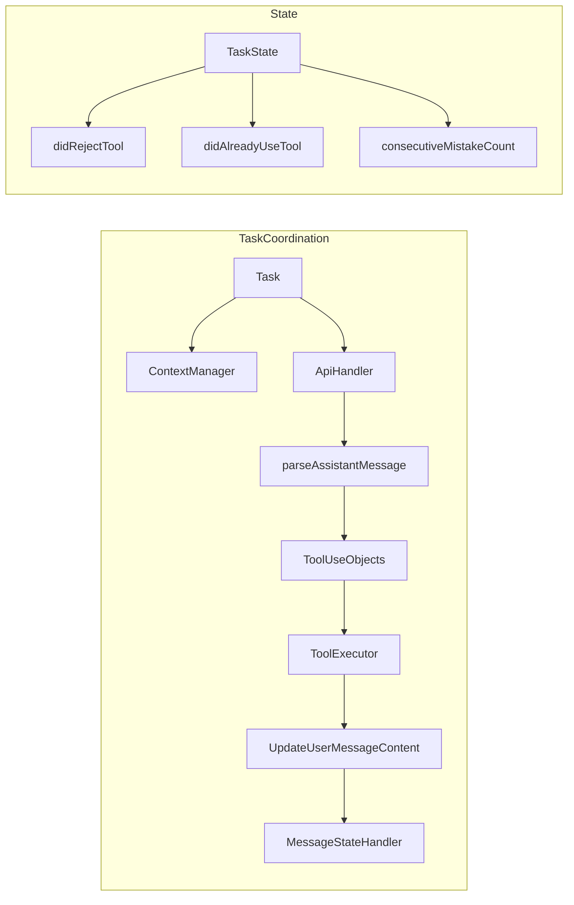

# WARP — Roblox Studio Copilot (Cline‑style tools, context, edits, and Asset Store)

> An implementation plan for a **Roblox Studio AI copilot** with a **Next.js** backend and an **LLM tool‑calling orchestrator**, refined to mirror Cline’s step‑by‑step tool usage, context management, and diff‑first editing.

---

## 0) What this is

* **Studio Plugin (Luau)**: docked chat + proposals, reads active editor state, previews diffs, applies edits inside **ChangeHistoryService**.
* **Next.js Backend (TypeScript)**: `/api/chat`, `/api/stream`, `/api/proposals/:id/apply`, `/api/assets/search`, plus an orchestrator that exposes tools to the LLM.
* **LLM Tool‑Calling**: one‑tool‑per‑message, approval‑first workflow (like Cline). The model proposes **proposals** (edits/object ops/asset ops); only the plugin performs writes after user approval.

---

## 1) System prompt (Roblox‑focused, Cline‑style)

Use a short, strict, tool‑centric system prompt. Keep it **deterministic** and **proposal‑first**.

```
You are a Roblox Studio copilot. You read the active script, inspect selection,
and propose safe, undoable changes. You must use exactly ONE tool per message.
Wait for each tool result before the next step.

# Tool call format (XML-like):
<tool_name>
  <param1>…</param1>
  <param2>…</param2>
</tool_name>

# Available tools (see JSON schemas below)
- get_active_script()
- list_selection()
- list_open_documents()
- show_diff(path, edits[])
- apply_edit(path, edits[])
- create_instance(className,parentPath,props)
- set_properties(path, props)
- search_assets(query,tags?,limit?)
- insert_asset(assetId,parentPath)

Rules:
- Never modify code or instances without an approved proposal.
- Keep context small; ask for more only when needed.
- Prefer minimal diffs and property deltas.
- Reference Roblox paths by canonical `GetFullName()`.
```

> Optional: **Plan vs Act** modes. In *Plan* mode, gather info and outline a plan. In *Act* mode, execute tools one step at a time.

---

## 2) Tool registry (JSON schema)

These are the server‑registered tools exposed to the LLM. Keep schemas strict and types narrow.

```json
{
  "tools": [
    {
      "name": "get_active_script",
      "description": "Return the current active script path and editor text.",
      "parameters": {"type": "object", "properties": {}, "required": []}
    },
    {
      "name": "list_selection",
      "description": "List current Selection with class/name/full path/properties.",
      "parameters": {"type": "object", "properties": {}, "required": []}
    },
    {
      "name": "list_open_documents",
      "description": "Return a small list of open ScriptDocuments (path, optional ranges).",
      "parameters": {"type": "object", "properties": {}, "required": []}
    },
    {
      "name": "show_diff",
      "description": "Preview text edits as a diff without applying.",
      "parameters": {
        "type": "object",
        "properties": {
          "path": {"type": "string"},
          "edits": {
            "type": "array",
            "items": {
              "type": "object",
              "properties": {
                "start": {"type": "object", "properties": {"line": {"type": "integer"}, "character": {"type": "integer"}}, "required": ["line", "character"]},
                "end":   {"type": "object", "properties": {"line": {"type": "integer"}, "character": {"type": "integer"}}, "required": ["line", "character"]},
                "text":  {"type": "string"}
              },
              "required": ["start", "end", "text"]
            }
          }
        },
        "required": ["path", "edits"]
      }
    },
    {
      "name": "apply_edit",
      "description": "Apply text edits to a script (plugin will do UpdateSourceAsync under ChangeHistory).",
      "parameters": {"$ref": "#/tools/3/parameters"}
    },
    {
      "name": "create_instance",
      "description": "Create an Instance and parent it.",
      "parameters": {
        "type": "object",
        "properties": {
          "className": {"type": "string"},
          "parentPath": {"type": "string"},
          "props": {"type": "object"}
        },
        "required": ["className", "parentPath"]
      }
    },
    {
      "name": "set_properties",
      "description": "Set properties on an existing instance by path.",
      "parameters": {
        "type": "object",
        "properties": {"path": {"type": "string"}, "props": {"type": "object"}},
        "required": ["path", "props"]
      }
    },
    {
      "name": "search_assets",
      "description": "Search the Roblox catalog for assets (server-side).",
      "parameters": {
        "type": "object",
        "properties": {"query": {"type": "string"}, "tags": {"type": "array", "items": {"type": "string"}}, "limit": {"type": "integer", "minimum": 1, "maximum": 50}},
        "required": ["query"]
      }
    },
    {
      "name": "insert_asset",
      "description": "Insert a catalog asset by ID under a parent path.",
      "parameters": {
        "type": "object",
        "properties": {"assetId": {"type": "integer"}, "parentPath": {"type": "string"}},
        "required": ["assetId"]
      }
    }
  ]
}
```

> **show\_diff** and **apply\_edit** share the same shape; **show\_diff** never writes.

---

## 3) Context gathering (plugin → backend)

**Plugin capture (Luau)**

```lua
local Selection = game:GetService("Selection")
local ScriptEditorService = game:GetService("ScriptEditorService")
local StudioService = game:GetService("StudioService")

local function getActiveScriptContext()
    local active = StudioService.ActiveScript
    if not active then return nil end
    return { path = active:GetFullName(), text = ScriptEditorService:GetEditorSource(active) }
end

local function getSelectionContext()
    local out = {}
    for _, inst in ipairs(Selection:Get()) do
        table.insert(out, { className = inst.ClassName, name = inst.Name, path = inst:GetFullName() })
    end
    return out
end
```

**Backend receive**

```ts
// app/api/chat/route.ts
export const runtime = 'nodejs'
import { z } from 'zod'
import { runLLM } from '@/lib/orchestrator'

const ChatSchema = z.object({
  projectId: z.string(),
  message: z.string(),
  context: z.object({
    activeScript: z.object({ path: z.string(), text: z.string() }).nullable(),
    selection: z.array(z.object({ className: z.string(), path: z.string() })).optional(),
    openDocs: z.array(z.object({ path: z.string() })).optional()
  })
})

export async function POST(req: Request) {
  const input = ChatSchema.parse(await req.json())
  const proposals = await runLLM(input) // returns structured proposals
  return Response.json({ proposals })
}
```

**Auto‑compaction (orchestrator)**

* Track tokens (`tokensIn + tokensOut + cacheWrites + cacheReads`).
* If near the model window, summarise & truncate older turns (prefer keeping the latest + a summarized history). Store telemetry for debugging.

---

## 4) Editing workflow (diff‑first, approval‑first)

**End‑to‑end**

1. LLM returns **proposals** (e.g., `type: 'edit' | 'object_op' | 'asset_op'`).
2. Plugin shows diffs/ops → **Approve** or **Reject**.
3. On approve: plugin wraps writes in `ChangeHistoryService:TryBeginRecording` / `FinishRecording` and performs:

   * Text edits: `ScriptEditorService:UpdateSourceAsync` with a transform function.
   * Object ops: `Instance.new`, set properties.
4. Plugin reports the result back to `/api/proposals/:id/apply` for auditing.

**Apply edit (Luau)**

```lua
local ScriptEditorService = game:GetService("ScriptEditorService")
local ChangeHistoryService = game:GetService("ChangeHistoryService")

local function applyEdit(scriptInstance, transformFn)
    if not ChangeHistoryService:TryBeginRecording("AI Edit", "AI Edit") then return false end
    local ok, err = pcall(function()
        ScriptEditorService:UpdateSourceAsync(scriptInstance, function(old)
            return transformFn(old)
        end)
    end)
    ChangeHistoryService:FinishRecording("AI Edit")
    return ok, err
end
```

**UX details (Cline‑style)**

* Always render a **diff preview** and require approval before saving.
* When rejected, **reset** the preview state (no write).
* One approved apply = one **meaningful undo step**.

---

## 5) Asset Store integration (search → insert → post‑configure)

**Server (Next.js)**

* `GET /api/assets/search?query=…&tags=…&limit=…` — Catalog search (server‑side). Also accepts legacy `q` as alias for `query`. Normalize results to `{ id, name, creator, type, thumbnailUrl }`.
* Optionally cache by `query` and tags.

**Plugin (Luau)**

```lua
local InsertService = game:GetService("InsertService")

local function insertAsset(assetId, parent)
    local container = InsertService:LoadAsset(assetId) -- returns a Model
    local model = container
    local childModel = container and container:FindFirstChildOfClass("Model")
    if childModel then model = childModel end
    model.Parent = parent or workspace
    return model
end
```

**LLM flow**

* `search_assets(query, tags?)` → assistant proposes a short pick list.
* On user choice, assistant emits `insert_asset(assetId,parentPath)` → plugin inserts → assistant follows with `set_properties` / `apply_edit` to wire scripts.

**Permissions**

* The **plugin** calls your backend domain only (user approves once via the built‑in HTTP permission prompt). The backend talks to Roblox’s web APIs.

---

## 6) Streaming & transport

* **Plugin**: default to **short polling** or **long‑polling** `/api/stream?cursor=…`. If SSE is available and reliable in your environment, the plugin can use it; otherwise keep long‑poll.
* **Web dashboard**: use SSE for token‑level streaming.
* Limit concurrent plugin HTTP requests (≤2) to avoid Studio’s in‑flight cap.

---

## 7) Safety & permissions

* **Script writes** only inside **ChangeHistoryService** recordings.
* **ScriptEditorService** only for reading/writing code (never touch `Script.Source` directly).
* **Two prompts** the first time: HTTP domain(s) and Script Modification.
* **Dry‑run mode**: preview diffs, no writes.
* **Audit**: store prompts, tool calls, proposals, final diffs, and outcomes.

---

## 8) Next.js orchestrator (TypeScript)

```
/lib/orchestrator/
  index.ts              // provider-agnostic run()
  providers/openai.ts   // function-calling adapter
  providers/anthropic.ts// tool-use adapter
  context.ts            // token tracking + summarization
  proposals.ts          // build proposals from tool calls
  tools.ts              // registry + zod schemas
```

**Key responsibilities**

* Load **system prompt** + **tool registry**.
* Maintain conversation context; summarise before overflow.
* Normalize tool calls → **proposals** (edit/object/asset).
* Persist proposals; expose to plugin.

---

## 9) UI sketches (plugin)

* **Chat**: messages, partial streaming rows, status (generating/applying/failed).
* **Context chips**: *Active Script*, *Selection*, *Open Docs* (click to attach as tags into the next prompt).
* **Proposals**: diff/ops list with **Apply**, **Apply & open file**, **Reject**.

---

## 10) Mermaid: full data flow

```mermaid
flowchart TD
    subgraph Studio Plugin (Luau)
        A[User asks] --> B[Collect context\nGetEditorSource + Selection]
        B --> C[/api/chat]
        J[Stream/Long-poll /api/stream] --> K[Render partial tokens]
        C -->|proposals| D[Diff/Operations UI]
        D --> E{Approve?}
        E -- Yes: edits --> F[TryBeginRecording\nUpdateSourceAsync\nFinishRecording]
        E -- Yes: assets --> G[InsertService:LoadAsset]
        F --> H[Report success]
        G --> H
        E -- No --> I[Reject]
    end

    subgraph Backend (Next.js)
        C --> L[LLM Orchestrator]
        L --> M[System prompt + Tool registry]
        M --> N[Model tool-call]
        N --> O[Proposal Builder]
        O --> C
        P[/api/assets/search/] --> Q[Catalog APIs]
        Q --> P --> L
        H --> R[Mark proposal applied]
    end

    subgraph Context Manager
        L --> S[Token accounting]
        S --> T{Near window?}
        T -- yes --> U[Summarize + truncate]
        U --> L
    end
```

---

## 11) Milestones (updated)

**M0 — Spike (1–2 days)**

* Dock widget + toolbar; read active script + selection; POST `/api/chat`; echo back.

**M1 — Edits (1–2 weeks)**

* Implement `show_diff` + `apply_edit` end‑to‑end with preview & single undo step.
* Error surfaces for unsaved edits / Team Create conflicts.

**M2 — Instances & properties (1–2 weeks)**

* `create_instance`, `set_properties` with selection chips → apply.

**M3 — Asset Store (1 week)**

* `/api/assets/search` + plugin picker + `insert_asset` + post‑configure script stubs.

**M4 — Orchestrator & Providers (1–2 weeks)**

* Tool adapters for OpenAI/Anthropic; deterministic JSON parsing; auto‑compaction.

**M5 — (Optional) Indexing**

* Snapshot route + luau‑lsp diagnostics + embeddings for retrieval.

---

## 12) Testing & observability

* **Localhost first** (`http://127.0.0.1:3000`) to trigger plugin HTTP permission.
* **Concurrency guard** (≤2 in‑flight requests) in the plugin.
* **Undo/redo**: every approved apply == one undo step.
* **Audit logs**: verify tool calls/proposals/diffs persisted.

---

## 13) Appendix: minimal code stubs

**Next.js tool registry (zod)**

```ts
// lib/tools.ts
import { z } from 'zod'

export const EditRange = z.object({ line: z.number(), character: z.number() })
export const Edit = z.object({ start: EditRange, end: EditRange, text: z.string() })

export const Tools = {
  get_active_script: z.object({}),
  list_selection: z.object({}),
  list_open_documents: z.object({}),
  show_diff: z.object({ path: z.string(), edits: z.array(Edit) }),
  apply_edit: z.object({ path: z.string(), edits: z.array(Edit) }),
  create_instance: z.object({ className: z.string(), parentPath: z.string(), props: z.record(z.any()).optional() }),
  set_properties: z.object({ path: z.string(), props: z.record(z.any()) }),
  search_assets: z.object({ query: z.string(), tags: z.array(z.string()).optional(), limit: z.number().min(1).max(50).optional() }),
  insert_asset: z.object({ assetId: z.number(), parentPath: z.string().optional() })
}
```

**Plugin request helper (Luau)**

```lua
local HttpService = game:GetService("HttpService")

local function postJson(url, body)
    return HttpService:RequestAsync({
        Url = url,
        Method = "POST",
        Headers = { ["Content-Type"] = "application/json" },
        Body = HttpService:JSONEncode(body)
    })
end
```

— end —

# 0a) Runtime split (Vercel‑hosted backend ↔ Studio plugin)

Below shows exactly **where each part runs** and **who is allowed to edit the scene/code**. The backend is the brain (planning, LLM tool orchestration, asset search/generation); the plugin is the hands (reads context, previews diffs, applies edits with undo/redo).

```mermaid
flowchart LR
    subgraph User_Studio["Roblox Studio (user)"]
        U[Developer types in chat] --> PUI[Plugin Chat UI]
    end

    subgraph Plugin["Studio Plugin (Luau)"]
        PUI --> CTX[Collect Context<br/>GetEditorSource • Selection • Open Docs]
        CTX --> REQ[HTTPS POST /api/chat]
        DIFFS[Diffs / Ops Preview] --> APPROVE{Approve?}
        APPROVE -- Yes: edits --> APPLY[ChangeHistoryService<br/>UpdateSourceAsync]
        APPROVE -- Yes: assets --> INSERT[InsertService:LoadAsset → set_properties]
        APPLY --> ACK[POST /api/proposals/:id/apply]
        INSERT --> ACK
        APPROVE -- No --> REJECT[Reject]
    end

    subgraph Backend["Next.js Orchestrator (Vercel)"]
        ROUTES[/api/chat • /api/stream* • /api/assets/search • /api/proposals/:id/apply/]
        ORCH[Tool‑Calling Orchestrator]
        PROVIDERS[OpenRouter / OpenAI / Anthropic]
        STORE[(DB • Cache • Audit Logs)]
        GEN3D[/api/assets/generate3d]
        GPU[GPU 3D Asset Gen Service]
    end

    subgraph Roblox_APIs["Roblox APIs"]
        CATALOG[Catalog/Marketplace Search]
        OPENCLOUD[Open Cloud Upload → assetId]
    end

    REQ --> ROUTES
    ROUTES --> ORCH --> PROVIDERS
    ORCH --> STORE
    ORCH -->|proposals JSON| DIFFS
    GEN3D --> GPU --> OPENCLOUD --> ORCH
    ROUTES --> CATALOG

    %% Notes: * Studio plugins cannot use SSE/WebSockets. Use short/long‑polling.
```

**Key points**

* **Only the plugin** can edit Roblox code/scene. The backend **never writes** to the place; it returns **proposals** (diffs, instance/property ops).
* First call to your domain (e.g. Vercel) triggers Studio’s **HTTP domain permission** prompt; first write triggers **Script Modification** permission.
* **Streaming inside Studio**: plugins **cannot** use WebSockets/SSE. Use **short/long‑polling** (`/api/stream` blocks up to N seconds, returns chunks). The web dashboard may use SSE.
* **Asset flows**: search via backend → propose → `InsertService:LoadAsset(assetId)` in plugin → optional `set_properties`.
* **3D generation**: backend calls GPU service → uploads via **Open Cloud** → returns `assetId` → plugin inserts.

**Minimal tool call snippet (for clarity)**

```
You are a Roblox Studio copilot. You read the active script, inspect selection,
and propose safe, undoable changes. You must use exactly ONE tool per message.
Wait for each tool result before the next step.

# Tool call format (XML‑like):
<tool_name>
  <param1>…</param1>
  <param2>…</param2>
</tool_name>
```

# 1) Tool registry & schemas (Cline‑style, Roblox‑native)

**One‑tool‑per‑message. Always preview before apply. All writes are inside `ChangeHistoryService`.**

### Call format the model must use

```
You are a Roblox Studio copilot. You read the active script, inspect selection,
and propose safe, undoable changes. You must use exactly ONE tool per message.
Wait for each tool result before the next step.

# Tool call format (XML‑like):
<tool_name>
  <param1>…</param1>
  <param2>…</param2>
</tool_name>
```

### Context tools

| Tool                          | Purpose                                 | Params        | Returns                              | Runs where    |
| ----------------------------- | --------------------------------------- | ------------- | ------------------------------------ | ------------- |
| `get_active_script()`         | Read active editor tab content reliably | —             | `{ path, text, isDirty }`            | Plugin (Luau) |
| `list_open_documents()`       | Enumerate open `ScriptDocument`s        | —             | `[{ path, isDirty }]`                | Plugin        |
| `list_selection()`            | Current Selection metadata              | —             | `[{ className, name, path, props }]` | Plugin        |
| `list_children(path)`         | Explore hierarchy under a node          | `path`        | `[{ className, name, path }]`        | Plugin        |
| `get_properties(path, keys?)` | Read specific props for an Instance     | `path, keys?` | `{ key:value }`                      | Plugin        |

### Editing tools (scripts & instances)

| Tool                                            | Purpose                        | Params                           | Returns                         | Runs where |
| ----------------------------------------------- | ------------------------------ | -------------------------------- | ------------------------------- | ---------- |
| `show_diff(path, edits[])`                      | Render diff preview (no write) | `path, edits[]` line/char ranges | `{ previewId }`                 | Plugin     |
| `apply_edit(path, edits[])`                     | Apply text edits with undo     | `path, edits[]`                  | `{ ok, beforeHash, afterHash }` | Plugin     |
| `create_instance(className, parentPath, props)` | Create & parent                | `className, parentPath, props`   | `{ path }`                      | Plugin     |
| `set_properties(path, props)`                   | Mutate props                   | `path, {key:value}`              | `{ ok }`                        | Plugin     |
| `rename_instance(path, newName)`                | Rename                         | `path, newName`                  | `{ path }`                      | Plugin     |
| `delete_instance(path)`                         | Delete safely                  | `path`                           | `{ ok }`                        | Plugin     |

### Asset Store & generation tools

| Tool                                                | Purpose                           | Params                           | Returns                                      | Runs where        |
| --------------------------------------------------- | --------------------------------- | -------------------------------- | -------------------------------------------- | ----------------- |
| `search_assets(query, tags?, limit?)`               | Search Roblox Catalog/Marketplace | `query, tags?, limit?`           | `[{ assetId, name, type, thumbnailUrl }]`    | Backend (Next.js) |
| `insert_asset(assetId, parentPath)`                 | Insert by id                      | `assetId, parentPath`            | `{ insertedPaths[] }`                        | Plugin            |
| `generate_asset_3d(prompt, tags?, style?, budget?)` | GPU 3D gen → Open Cloud upload    | `prompt, tags?, style?, budget?` | `{ assetId, name, polyCount, thumbnailUrl }` | Backend + GPU     |

### Analysis/CI tools (backend jobs)

| Tool                                | Purpose                        | Params                   | Returns                         | Runs where       |
| ----------------------------------- | ------------------------------ | ------------------------ | ------------------------------- | ---------------- |
| `analyze_luau(snapshotId?, files?)` | Run `luau-lsp analyze`         | `snapshotId? or files[]` | `{ diagnostics[] }`             | Backend          |
| `run_tests(testPattern?)`           | Run TestEZ in runner container | `testPattern?`           | `{ passed, failed, reportUrl }` | Backend          |
| `snapshot_project()`                | Gzip editor state for analysis | —                        | `{ snapshotId, size }`          | Plugin → Backend |

> **Mapping to Cline**: `read_file` → `get_active_script`; `write_to_file/replace_in_file` → `apply_edit`; `list_files/search_files` → `list_children` + `list_selection`; `execute_command/browser_action` → **backend jobs** (`analyze_luau`, `search_assets`, `generate_asset_3d`).

---

# 2) Result types & formatting (what users see)

The backend returns **Proposals**. The plugin formats them into the chat + a side panel (diff or op cards) and asks for **Approve/Reject**. After execution, it writes a compact status to the chat.

### Proposal types

* `edit` — `{ path, diff:{mode:"rangeEDITS", edits:[{start:{line,character}, end:{line,character}, text}]}, notes? }`
* `object_op` — `ops:[ { op:"create_instance"|"set_properties"|"rename_instance"|"delete_instance", ... } ]`
* `asset_op` — `search:{ query,tags,limit }` or `insert:{ assetId,parentPath }` or `generate3d:{ prompt,.. }`

### Output formatter (Cline‑style)

* `toolResult(proposalId, summary)` → message block with ✅ and a compact table of changes
* `toolError(proposalId, error)` → 🔴 error with actionable hint
* `toolDenied(proposalId, reason)` → 🚫 user rejected
* Specialized:

  * `fileEditWithUserChanges(path, userEditsDiff)` (if user tweaks the diff before save)
  * `formatAssetsList(results[])` (grid of asset cards with thumbnails)

```mermaid
flowchart TB
  subgraph ResponseTypes[Response Types]
    A[Successful Tool Result] --> B[formatResponse.toolResult()]
    C[Tool Error] --> D[formatResponse.toolError()]
    E[User Denied Tool] --> F[formatResponse.toolDenied()]
    G[Specialized Formats] --> H[formatResponse.fileEditWithUserChanges()]
    G --> I[formatResponse.formatAssetsList()]
  end
  B --> J[User Message Content]
  D --> J
  F --> J
  H --> J
  I --> J
```

**Chat examples**

* *After previewing an edit*: “Proposed **2 line changes** to `Workspace.Button.Script` (replacing Touched with ProximityPrompt).” → \[Approve] \[Open Diff]
* *After apply*: “✅ Applied edit to `Workspace.Button.Script`. 1 undo step created.”
* *Asset search*: grid of up to 12 items with thumbnail, name, `Insert` buttons.

---

# 3) Minimal Luau handlers (short, illustrative)

```lua
-- get_active_script()
local StudioService = game:GetService("StudioService")
local ScriptEditorService = game:GetService("ScriptEditorService")
return function()
    local s = StudioService.ActiveScript
    if not s then return { path = nil, text = nil, isDirty = false } end
    local ok, src = pcall(function() return ScriptEditorService:GetEditorSource(s) end)
    return { path = s:GetFullName(), text = ok and src or "", isDirty = true }
end
```

```lua
-- apply_edit(path, edits[])  (single waypoint)
local ChangeHistoryService = game:GetService("ChangeHistoryService")
local ScriptEditorService = game:GetService("ScriptEditorService")
return function(scriptInstance, edits)
    if not ChangeHistoryService:TryBeginRecording("AI Edit", "AI Edit") then
        return { ok = false, error = "Cannot start recording" }
    end
    local ok, err = pcall(function()
        ScriptEditorService:UpdateSourceAsync(scriptInstance, function(old)
            -- assume edits already merged server‑side to one final text
            return edits.__finalText or old
        end)
    end)
    ChangeHistoryService:FinishRecording("AI Edit")
    return { ok = ok, error = err }
end
```

```lua
-- insert_asset(assetId, parentPath)
local InsertService = game:GetService("InsertService")
return function(assetId, parent)
    local model = InsertService:LoadAsset(assetId)
    model.Parent = parent
    return { insertedPaths = { model:GetFullName() } }
end
```

> **Note**: Production code should resolve `path → Instance`, validate classes/props, and merge multiple text edits to final source before `UpdateSourceAsync`.

---

# 4) Next.js API (thin orchestrator skeleton)

```ts
// app/api/chat/route.ts
export const runtime = 'nodejs'
import { z } from 'zod'
import { runLLM } from '@/lib/orchestrator'
const Chat = z.object({
  projectId: z.string(),
  message: z.string(),
  context: z.object({
    activeScript: z.object({ path: z.string(), text: z.string() }).nullable(),
    selection: z.array(z.object({ className: z.string(), path: z.string() })).optional(),
  }),
})
export async function POST(req: Request) {
  const input = Chat.parse(await req.json())
  const proposals = await runLLM(input) // returns edit/object_op/asset_op
  return Response.json({ proposals })
}
```

```ts
// lib/tools/schemas.ts (JSON Schema-ish)
export const tools = {
  apply_edit: {
    params: {
      path: 'string',
      edits: [{ start: { line: 'int', character: 'int' }, end: { line: 'int', character: 'int' }, text: 'string' }],
    },
  },
  create_instance: { params: { className: 'string', parentPath: 'string', props: 'record' } },
  set_properties: { params: { path: 'string', props: 'record' } },
  search_assets: { params: { query: 'string', tags: ['string?'], limit: 'int?' } },
  insert_asset: { params: { assetId: 'number', parentPath: 'string' } },
}
```

```ts
// app/api/assets/search/route.ts
export async function GET(req: Request) {
  const { searchParams } = new URL(req.url)
  const query = searchParams.get('q') || ''
  const limit = Number(searchParams.get('limit') || '8')
  // Call Roblox catalog via your server integration
  const results = await searchRobloxCatalog(query, limit)
  return Response.json({ results })
}
```

```ts
// app/api/assets/generate3d/route.ts (GPU job)
export async function POST(req: Request) {
  const { prompt } = await req.json()
  const jobId = await enqueue3DJob(prompt)
  return Response.json({ jobId })
}
```

---

# 5) System prompt (final excerpt)

```
You are Vector, a Roblox Studio copilot.

Operating mode
- Proposal-first: never write to code or instances directly. Always propose edits/ops; the plugin applies them only after user approval.
- One tool per message: emit exactly one tool call per assistant turn; wait for the tool result before the next step.
- Keep context small: request only the minimum context via tools (get_active_script, list_selection, list_open_documents, etc.) when needed.

Tool call format (XML-like; one per message)
<tool_name>
  <param1>...</param1>
  <param2>...</param2>
</tool_name>

Editing rules
- Scripts: propose edit with diff.mode="rangeEDITS" using zero-based {line,character} positions.
- Preview before apply: first request show_diff(path, edits[]); after user approval, request apply_edit(path, edits[]).
- Instances: propose object_op with minimal operations (create_instance, set_properties, rename_instance, delete_instance). Use canonical Instance:GetFullName() paths.
- Assets: search_assets -> present shortlist; on user choice -> insert_asset -> optionally set_properties.

Safety
- All writes occur in the plugin inside ChangeHistoryService recordings.
- Use ScriptEditorService APIs to read/write source (never touch Script.Source directly).
- Prefer minimal diffs and property deltas. Never perform broad rewrites without explicit instruction.

Good behavior
- Ask for missing context only when required.
- Reference paths and names precisely; avoid ambiguity.
- If a proposal could be large, stage it into multiple small, reviewable proposals.

Output expectations
- Return concise, actionable proposals:
  - edit: { path, diff:{ mode:"rangeEDITS", edits:[...] }, notes? }
  - object_op: { ops:[ { op:"...", ... } ], notes? }
  - asset_op: { search:{...} | insert:{...}, notes? }

Plan vs Act (optional)
- Plan: outline a short plan and which tool you will call next.
- Act: issue one tool call, wait for result, then continue.
```

---

# 6) Plan/Act loop & state



**Behavior**

* Plan Mode (optional): multi‑step plan cards → user toggles to Act Mode
* Act Mode: one tool → preview → Approve/Reject → apply → audit

---

# 7) File structure (monorepo)

```
warp/
  apps/
    web/                # Next.js (Vercel)
      app/api/chat/route.ts
      app/api/assets/search/route.ts
      app/api/assets/generate3d/route.ts
      app/api/proposals/[id]/apply/route.ts
      lib/orchestrator/
      lib/tools/schemas.ts
    dashboard/          # optional web UI with SSE
  packages/
    shared/             # zod schemas, types
    orchestrator/       # provider adapters (OpenRouter/OpenAI/Anthropic/local)
    diff/               # text edit merging utilities
  plugin/               # Roblox Studio plugin (Luau)
    src/
      ui/
      net/
      tools/            # Luau handlers for tools above
      services/
      main.server.lua   # toolbar + dock widget bootstrap
    rojo.json
    selene.toml
    stylua.toml
  infra/                # GPU jobs, queues, Open Cloud uploader
  README.md
  WARP.md
```

**Style/linting**

* **Luau**: Selene + Stylua
* **TS**: ESLint + Prettier

---

# 8) Safety & permissions

* First network call to your domain prompts **HTTP permission**.
* First write prompts **Script Modification permission**.
* All writes inside **ChangeHistoryService** for undo/redo.
* Asset insertion only from **approved assetIds**; surface thumbnails & creators.
* No Roblox web endpoints from plugin; all via your backend.

---

# 9) Big‑ask behavior (e.g., “make a Jailbreak‑like game”)

* The model emits a **scaffold plan** → proposals in stages (map → vehicles → roles → GUIs → gameplay scripts).
* Every stage is previewed and requires approval; nothing overwrites silently.
* Optional: long jobs (3D gen, analysis) return jobIds; plugin polls `/api/jobs/:id`.

---

# 10) Deliverables checklist for M1

- Docked chat UI, context capture, HTTP permission flow — implemented
- `/api/chat` round-trip producing `edit` and `object_op` proposals — implemented
- Diff preview + one-click **Apply** (single undo step) — full unified diff renderer implemented; shows context, additions/deletions, multiple hunks, with Open/Close Diff toggle
- Asset search + insert flow — implemented (server stub + plugin Browse + Insert)
- Audit log of proposals and outcomes — implemented with file-backed JSON durability and apply acknowledgements

---

## Implementation Progress — 2025-08-31 (updated @ 21:06 UTC)

Recent updates

- Added zod-based validation of provider tool-call arguments before mapping to proposals
- Added Plan/Act scaffold: executes context tools locally and performs a second provider call for the next actionable tool
- Switched proposals store to file-backed JSON durability (apps/web/data/proposals.json)
- Catalog provider interface via CATALOG_API_URL — no stub fallback; explicit 502 errors on failure
- Server-side diff preview shaping (unified diff) added to edit proposals; plugin renders preview snippet
- Provider errors now surfaced (no fallback when provider is configured via Settings); errors bubble to plugin UI

Decisions captured

- AI name: Vector (assistant name in UI and comments)
- LLM provider: OpenRouter, model: moonshotai/kimi-k2:free
- Package manager: npm
- Hosting: Local dev at http://127.0.0.1:3000 for now. We will move to Vercel (or similar) later.
- Domain permissions: local-only for now; will add hosted domain later when deploying.
- Plugin install workflow: Rojo during development → export .rbxm for small tester group → publish to Marketplace for public release.
- System prompt: refined Vector prompt (one-tool-per-message, proposal-first, minimal diffs).

Working now

- Web (Next.js + npm)
  - Local app scaffold (Next 14) with npm scripts; landing page at /.
  - API routes wired: /api/chat persists proposals to a file-backed store for auditing; /api/proposals/[id]/apply records an audit event; /api/proposals (GET) lists stored proposals; /api/assets/search calls a Catalog provider (CATALOG_API_URL required; no fallback); /api/assets/generate3d returns a stub jobId.
  - Provider tool-call parsing (OpenRouter) behind flags or per-request Settings: model outputs exactly one XML-like tool call which is parsed and mapped to proposals. Arguments validated with zod; when provider is configured, errors are surfaced (no fallback).
  - Plan/Act scaffold behind VECTOR_PLAN_ACT=1: if the first tool is a context tool (get_active_script, list_selection, list_open_documents), we execute it locally from the provided context, store the result in a short session, and issue a second provider call using that result to get the next actionable tool.
  - Provider adapters present: openrouter.ts (call path), openai.ts (stub).
- Plugin (Vector)
  - Dock UI with input + Send. Sends context (active script + selection) to /api/chat and renders proposals.
  - Approve/Reject per proposal; applies:
    - edit proposals that insert text via rangeEDITS (merged, UpdateSourceAsync with undo)
    - object_op rename_instance (ChangeHistoryService wrapped)
  - Settings panel: Base URL, API Key, Model ID; per-request provider used by /api/chat.
  - Reports apply results back to /api/proposals/:id/apply for auditing.
  - Diff preview snippet: shows unified diff from server for quick review.

Configured locally

- Environment
  - Use plugin Settings for provider credentials; env not required for local testing.
  - VECTOR_USE_OPENROUTER=0 by default; set to 1 to enable provider-driven tool-call parsing without passing Settings.
  - VECTOR_PLAN_ACT=0 by default; set to 1 to enable a second provider call after context tools (Plan/Act scaffold).
  - CATALOG_API_URL optional: when set, /api/assets/search calls this URL to fetch normalized results; otherwise it uses a stub list.
  - Data directory: proposals are persisted to apps/web/data/proposals.json (auto-created on write).
  - Do not commit .env to version control (ignored). Provider keys live only in plugin Settings.

Not yet implemented (next milestones)

- Provider-driven tool-call execution loop (multi-turn Plan/Act with context tools) and stricter validation/guardrails
- Robust diff merging on server (multi-edit merging) and generalized path→Instance resolution
- Asset Catalog integration (real Catalog API instead of stub) and GPU 3D generation → Open Cloud upload
- Rich plugin UI: full diff preview (line-by-line, deletions/edits), improved status/streaming, thumbnails for assets
- Persistence: move from file-backed JSON to a durable DB/schema (e.g., SQLite/Prisma), richer auditing and listing endpoints (filter by projectId)
- Packaging/deploy: Vercel hosting, domain allowlisting in Studio

Needs from you

- Approvals to proceed:
  - Wire plugin context capture to POST /api/chat and display proposals in the Vector dock.
  - Implement diff preview UI with Approve/Reject and undo semantics.
  - Enable the provider-backed path (OpenRouter) and tool-call parsing after initial local verification.
- Later (not blocking M0/M1):
  - Roblox Open Cloud credentials for 3D generation and asset uploads (generate3d flows).
  - Catalog API integration details/keys if we query Roblox web APIs server‑side (optional).

Recommended next steps (proposed M0 path)

1) Verify npm install in warp/apps/web and run the local dev server (npm run dev) — pending verification

Note on cline_openai.md

- Populated with a concise Vector system prompt (Cline‑style). We will refine it as the tool registry and execution loop evolve.

### How to run locally

- Web (from a new terminal):
  - cd warp/apps/web
  - npm install
  - Ensure your .env or .env.local contains OPENROUTER_API_KEY and OPENROUTER_MODEL=moonshotai/kimi-k2:free
  - Optional: set VECTOR_USE_OPENROUTER=1 to attach provider notes
  - npm run dev
- In Roblox Studio:
  - Load the plugin (via Rojo or by placing the plugin folder)
  - Click the Vector toolbar button to open the dock
  - Click "Vector Settings" to enter your provider info (OpenRouter-compatible). Use Base URL `https://openrouter.ai/api/v1`, paste your API Key, and choose a Model ID (e.g., `moonshotai/kimi-k2:free`). Saved locally via plugin settings.
  - Type a message, click Send
  - Approve/Reject proposals; edits and rename ops will apply as described

### Notes and next steps

- Known limitations in this increment:
  - Diff renderer falls back to a simplified mode for very large files; multi-edit diffs are supported but may be slower on very large scripts
  - Edits merging handles the current insertion case well, but not complex multi‑edit scenarios yet
  - Asset search uses stubbed backend data and shows a text list (no thumbnails yet)
  - Plan/Act is a single additional step (context tool then actionable tool); a full multi-turn loop remains
- Recommended follow‑ups:
  - Optimize diff computation for very large scripts; consider server-side precomputation for proposals with many edits
  - Add real Catalog integration on the server and show thumbnails in the plugin UI
  - Persist proposals/audit records in a durable store and add filtering endpoints
  - Move to Vercel and add the hosted domain to Studio’s allowed list
  - Expand provider tool‑call parsing into a full multi-turn Plan/Act execution loop with guardrails and retries

---

## Local Provider Settings (no .env required)

- Goal: avoid committing secrets to git. Configure provider credentials inside Roblox Studio, per-user.
- Open the toolbar item "Vector Settings" to configure:
  - Base URL: e.g., `https://openrouter.ai/api/v1` (OpenAI-compatible)
  - API Key: your provider key (stored locally via `plugin:SetSetting`, never committed)
  - Model ID: e.g., `moonshotai/kimi-k2:free` or `deepseek/deepseek-chat`
- Transport & Security:
  - The plugin sends `provider` in the `/api/chat` body: `{ name:'openrouter', baseUrl, apiKey, model }`.
  - The server uses these values for the provider call and does not persist them (only proposals are stored).
  - `.gitignore` excludes env files under `warp/apps/web` and the local `data/` folder.
